# Mimir

<p align="center">
  
</p>

<p>
  <a href="LICENSE.txt"></a>
  <a href="spec/"></a>
  
  
  
  
  <a href="https://www.repostatus.org/#active"></a>
</p>

> **An @enchanter-ai product — cryptographic provenance, economic-security teeth, honest-numbers contract.**

The first MCP-layer standard that binds *request + result + sources* under one signature, with restaked-stake slashing if it later turns out to be wrong.

**1 spec. 3 reference implementations. 15 adversarial vectors. 4 live contracts. One signature.**

> Today you ask an agent: *"pull the latest 8-K for Acme, summarize the risk-factor section, cite the exact paragraphs."*
>
> It comes back with a polished answer. Six weeks later, an auditor asks: *did the agent actually read the 8-K, or did it hallucinate the citations?*
>
> Your stack has a log line that says *"tool returned this string"* — server-side, unsigned, trivially backdate-able, with no binding to the request or the sources. The agent itself has no idea whether its source list is the one the server signed off on.
>
> Mimir is the receipt the auditor needs. Ed25519 over RFC-8785-canonical `(tool_id, tool_version, invoked_at, invoked_by, request_digest, result_digest, sources[])`, with the issuer's restaked stake on the line if any signed field was lying.

## TL;DR

**In plain English:** AI agents make tool calls all day, and right now there's no proof afterwards of what they actually asked, what they actually got back, or which sources actually backed the answer. Mimir signs every tool-call result like a sealed envelope — and if the seal ever turns out to be a lie, the issuer's on-chain stake gets slashed. Live on Sepolia today.

**Technically:** Mimir defines a Standards Track envelope spec (v2.1) signed Ed25519 over RFC-8785-JCS-canonical `(tool_id, tool_version, invoked_at, invoked_by, request_digest, result_digest, sources[])`. A σ-bound scoring oracle (Claude Sonnet 4.6, 5-axis × 8-SAT) gates DEPLOY only when *σ < 0.75 ∧ overall ≥ 9.0 ∧ min-axis ≥ 7.0 ∧ all 8 assertions pass* (empirically calibrated against a 50-case labeled set, 100% precision). On-chain, `MimirValidationRegistry` (ERC-8004 shape) anchors envelope digests and routes accepted fraud proofs through `EigenLayerSlasherAdapter` → EigenLayer v2 `AllocationManager.slash(SlashingParams)` — proven live on Sepolia with 4/4 `SlashingParams` field assertions reading back correctly from on-chain state. Three independent verifiers (Go, Rust, TypeScript) all parse the same canonical form from the spec alone.

## Origin

Three failures, in roughly the order they kept happening, became the reason Mimir exists.

**Failure 1 — the citation that wasn't there.** A finance team had a Claude-Code-driven agent pulling earnings filings, summarizing risk factors, and quoting specific paragraphs back to analysts. Two weeks in, a junior analyst tried to look up one of the cited paragraphs and couldn't find it in the source PDF. The MCP server log said *"tool returned this string"* — unsigned, server-side, no binding between the request that came in and the sources the agent emitted. The team had no way to tell whether the agent had hallucinated, whether the MCP server had returned the wrong document, or whether someone had tampered with the log line after the fact. There was no receipt. There was just a log.

**Failure 2 — the swappable source list.** Even when the server *did* return what it claimed, nothing tied the source URLs in the response to the bytes of the response. An adversarial server (or a compromised one, or a developer mistake) could return `result = "Apple's gross margin is 46%"` with `sources = [apple-10k.pdf]` and a downstream consumer would have no way to detect that the actual source the agent read was `competitor-blog.html`. JWTs sign the *claims*; COSE signs the *header + payload*; ERC-8004 signs the agent's *identity*. Nobody signs `(request, result, sources)` together.

**Failure 3 — no economic cost to lying.** Once agent-to-agent commerce shows up — one agent paying another for a tool call — the worst-case for a lying issuer is reputational. Reputational damage isn't a contract; you can't rebuild a wallet from "we trusted them." For agent-to-agent finality you need a slashable bond: the issuer puts something at stake when they sign, and a successful fraud proof takes a piece of it.

Mimir is the receipt for those three failures: one Ed25519 signature over the whole tool-call context, three explicit validation levels (well-formed / cryptographically-valid / trust-anchored), an on-chain anchor that routes accepted fraud proofs to a real EigenLayer slash on the issuer's restaked allocation. The full call path is proven live on Sepolia — not narrative, not whitepaper, four contracts and a working slash.

### Why "Mimir"

**Mimir** takes its name from **Norse cosmology** — the giant who guarded the Well of Wisdom at one of the three roots of Yggdrasil. The well preserved every memory the cosmos ever held; to drink from it, the All-Father Odin gave up an eye. Knowledge worth preserving had to cost something to fabricate. When the giant himself was beheaded in the Æsir-Vanir war, Odin embalmed Mimir's head with herbs and carried it as a counselor: a *queryable memory* that could be asked, after the fact, what really happened.

That is, almost literally, what this project does. Every MCP tool call gets a Mimir-head — a sealed, queryable record of what the agent asked, what the tool returned, and which sources backed the answer. The "knowledge has to cost something to fabricate" part is encoded in the restaked stake the issuer puts up: an issuer who signs a lying envelope loses real allocation when the fraud proof lands. The well is on-chain (Sepolia today); the embalming is RFC 8785 + Ed25519; the cost of fabrication is denominated in EigenLayer wads.

The name came after the design, not before — the design came from the three failures above; the giant came after, when the design needed a one-word handle for the thing it was building.

The question this project answers: *what did the agent actually do, and what does it cost the issuer if the answer was a lie?*

## Who this is for

- **MCP server authors** who want their tool outputs to carry a cryptographic guarantee a third party can verify without trusting the server.
- **MCP clients / agents** (Claude Desktop, Cursor, Cline) that want to surface provenance metadata to users and downstream consumers.
- **Restaking / AVS operators** who want a turnkey on-chain anchor + slashing target for off-chain attestations.
- **Spec implementers** — anyone writing an independent verifier from the published Standards Track draft.
- **Auditors** evaluating the cryptographic + economic-security claims of an agent provenance system.

Not for:

- Single-user, single-session prototyping with no audit trail required — running a Mimir issuer is overkill if no third party will ever verify the envelope. Just call the tool.
- Cases where the tool result is non-deterministic in a way that makes `result_digest` meaningless (a streaming sensor feed, an open-ended creative generation). Mimir signs a snapshot; that snapshot has to be the thing the consumer actually saw.

## Contents

- [How It Works](#how-it-works)
- [What Makes Mimir Different](#what-makes-mimir-different)
- [The Full Lifecycle](#the-full-lifecycle)
- [The Math Behind Mimir](#the-math-behind-mimir)
- [Install](#install)
- [Quickstart](#quickstart)
- [The Numbers](#the-numbers)
- [vs Everything Else](#vs-everything-else)
- [Architecture](#architecture)
- [Acknowledgments](#acknowledgments)
- [Versioning & release cadence](#versioning--release-cadence)
- [Contributing](#contributing)
- [Citation](#citation)
- [License](#license)

| Path | Purpose |
|---|---|
| [`spec/`](spec/) | The **MCP Tool-Call Provenance Envelope** specification — v2.1 Standards Track draft (CC0). [`spec/spec.pdf`](spec/spec.pdf) is the rendered PDF. |
| [`spec/reference-impl-rust/`](spec/reference-impl-rust/) | **Independent Rust verifier** written from the spec alone — proves the spec is implementable without reading the Go code. |
| [`spec/reference-impl-ts/`](spec/reference-impl-ts/) | **TypeScript SDK** for envelope production + verification, embeddable into MCP clients / servers. |
| [`spec/test-vectors-adversarial/`](spec/test-vectors-adversarial/) | **15 adversarial test vectors** — signature tampering, replay-window, alg downgrade, field-tampering on every signed field. |
| [`issuer/`](issuer/) | **Go HTTP issuer** — three KMS backends (ephemeral / mock / AWS KMS), DPoP ClientIdentityProof, JWK rotation, per-IP rate-limit, structured tracer. |
| [`scoring/`](scoring/) | **TypeScript scoring service** routing tool-call results through Claude Sonnet 4.6 on a 5-axis × 8-assertion σ-bound rubric. |
| [`scoring/calibration/`](scoring/calibration/) | **50-case labeled calibration set** — empirical proof that the rubric discriminates quality at 100% precision. |
| [`anchor/`](anchor/) | **On-chain settlement** — `MimirValidationRegistry` (ERC-8004 shape) + `EigenLayerSlasherAdapter` + mocks. Live on Sepolia. |
| [`bench/`](bench/) | Throughput + concurrency benchmark — 1500 RPS sustained, 0 races at 500-goroutine stress. |
| [`tests/mcp/`](tests/mcp/) | End-to-end interop using the official Anthropic MCP SDK. |
| [`examples/mcp-server-starter/`](examples/mcp-server-starter/) | 60-line starter template — fork this for your first Mimir-attested MCP tool. |
| [`deploy/aws-kms/`](deploy/aws-kms/) | Terraform + shell scripts for AWS KMS provisioning. |
| [`demo.py`](demo.py) | One-command end-to-end demo (MOCK_MODE, no credentials needed). |

## How It Works

Mimir is not a single service — it's a four-process pipeline plus an on-chain anchor. A user invokes an MCP tool through Claude Desktop / Cursor / Cline. Your MCP server runs the tool, gets the raw result, ships `(request, result)` to a **scoring oracle** (Claude Sonnet 4.6, σ-bound across 5 axes and 8 SAT assertions). If — and only if — the verdict is DEPLOY, the server posts to the **issuer**, which canonicalizes the envelope per RFC 8785, computes SHA-256 digests over the request and result, and signs the whole canonical form with Ed25519 via AWS KMS. The signed envelope goes back to the MCP client alongside the result. An **independent verifier** (Rust, TS, Go, or anything that can do JCS + Ed25519) can recompute the canonical form and check the signature against the published JWK. An optional on-chain step calls `MimirValidationRegistry.register(digest)` so the envelope is globally referenceable; an optional fraud-dispute step calls `revoke(digest, proof)` which routes through `EigenLayerSlasherAdapter` to a real EigenLayer v2 `AllocationManager.slash(SlashingParams)`, reducing the issuer's restaked allocation.

<p align="center">
  <a href="docs/assets/envelope-flow.mmd" title="View envelope-flow source (Mermaid)">
    
  </a>
</p>

<sub align="center">

Source: [docs/assets/envelope-flow.mmd](docs/assets/envelope-flow.mmd) · Regeneration command in [docs/assets/README.md](docs/assets/README.md).

</sub>

Three validation levels per spec § 12 — a consumer reads the envelope and picks the level its threat model demands:

1. **Syntactically well-formed.** JSON parses, all required fields present, types match. Anyone can run this with no key material.
2. **Cryptographically valid.** Ed25519 signature verifies against the issuer's published JWK. The whole canonical form is bound — tamper one field and the signature breaks.
3. **Trust-anchored.** DPoP `ClientIdentityProof` extension (spec § 6.11) proves *which client actually invoked the tool*, not just that the issuer is willing to sign for it.

## What Makes Mimir Different

### One signature binds request + result + sources

Every existing standard signs only a piece: JWT signs the claims, COSE signs the header + payload, ERC-8004 signs the agent's identity, EAS signs attestation data without binding it to the call that produced it. **Mimir signs the whole tool-call context under one canonical form** — RFC 8785 JCS over `(tool_id, tool_version, invoked_at, invoked_by, request_digest, result_digest, sources[])`. Tamper any field and the signature breaks; the 15-vector adversarial suite proves every signed field is bound (`tool_id`, `invoked_by`, `sources`, the digests, the timestamp, all of them, individually).

### σ-bound DEPLOY rule, empirically calibrated

Most quality-scoring systems return a single number. Mimir's scoring oracle returns 5 axes (clarity, specificity, faithfulness, safety, structure) plus 8 SAT assertions, and only emits a DEPLOY verdict when *σ across content axes < 0.75 ∧ overall ≥ 9.0 ∧ every axis ≥ 7.0 ∧ 8/8 assertions pass*. The σ threshold of 0.75 was not picked because it sounded good — it was empirically calibrated against a 50-case labeled set (27 known-good, 23 known-bad). **Result: 100% precision** — every case the rubric DEPLOY'd was genuinely good, zero false positives across 23 deliberately-bad cases including hallucination, sycophancy, evasion, incompleteness, and format-mismatch.

### Restaked-stake slashing on fraud-proof replay

`MimirValidationRegistry` anchors envelope digests on-chain. Anyone who can produce a fraud proof for a registered envelope calls `revoke(digest, proof)`. In AVS mode this fires `slasher.slash(operator, wadSlashed, reasonHash)` — and via the `EigenLayerSlasherAdapter`, that becomes a real EigenLayer v2 `AllocationManager.slash(SlashingParams)` call that reduces the issuer's restaked allocation. **The economic-security claim is not narrative — the call path is proven live on Sepolia with 4/4 `SlashingParams` field assertions reading back correctly from on-chain state.**

### Three explicit validation levels, not one trust decision

Most attestation systems force a binary: trust the issuer or don't. Mimir distinguishes well-formed (anyone can check the JSON shape with no keys) from cryptographically-valid (signature checks out against the published JWK) from trust-anchored (DPoP proves the actual client invoked the tool). A consumer reading an envelope picks the level its threat model requires — and an auditor can independently inspect the gap between *what was signed* and *what was attested-to-by-the-client*.

### Restaking-primitive agnostic via adapter pattern

Mimir's `ISlasher` interface stays narrow: `slash(operator, wadSlashed, reasonHash)`. Operators bridge to whichever restaking primitive they use — EigenLayer today (via `EigenLayerSlasherAdapter`), Symbiotic / Karak / Babylon tomorrow (via parallel adapters). The registry contract itself doesn't change; the adapter handles the primitive-specific ABI. Live proof on Sepolia: the same registry contract drives both a permissionless deployment (no slashing) and an AVS-mode deployment (operator-gated + adapter-routed slashing) without source changes.

### Honest-numbers contract through-and-through

Every claim in this README is backed by a runnable test, a calibration artifact, or a live on-chain transaction. No marketing math: the σ-bound bar of 0.75 was empirically calibrated against a 50-case labeled set (`scoring/calibration/`); the 1500 RPS throughput was measured under a 500-goroutine concurrency stress test (`bench/`); the live AWS KMS latency of 97–112 ms p50 was measured against the actual production-shape KMS key in eu-west-1; the 14/14 anchor assertions are tied to specific Sepolia transaction hashes in [`docs/deployments.md`](docs/deployments.md). If a number is in this repo, you can reproduce it.

## The Full Lifecycle

A tool call moves through eight steps; only steps 1–5 are mandatory. Steps 6–8 are optional and triggered by different actors at different times.

<p align="center">
  <a href="docs/assets/lifecycle.mmd" title="View lifecycle source (Mermaid)">
    
  </a>
</p>

<sub align="center">

Source: [docs/assets/lifecycle.mmd](docs/assets/lifecycle.mmd) · Regeneration command in [docs/assets/README.md](docs/assets/README.md).

</sub>

The fraud-dispute path is what makes the system *economically* — not just cryptographically — accountable. The flow below shows what happens on `revoke()`:

<p align="center">
  <a href="docs/assets/slashing.mmd" title="View slashing source (Mermaid)">
    
  </a>
</p>

<sub align="center">

Source: [docs/assets/slashing.mmd](docs/assets/slashing.mmd) · Regeneration command in [docs/assets/README.md](docs/assets/README.md).

</sub>

## The Math Behind Mimir

Five engines, each with a formal definition. Full derivations + proofs live in [`docs/science/README.md`](docs/science/README.md); the math runs as code in `issuer/`, `scoring/`, `anchor/`, and `spec/reference-impl-*/`.

### M1 — Envelope canonicalization and signature

Let envelope $E$ have signed-fields tuple $F(E)$ comprising the seven fields `tool_id`, `tool_version`, `invoked_at`, `invoked_by`, `request_digest`, `result_digest`, and `sources`. Then:

$$C(E) = \mathrm{JCS}_{\mathrm{RFC8785}}\bigl(F(E)\bigr)$$

$$\sigma_E = \mathrm{Ed25519\text{-}sign}_{sk}\bigl(C(E)\bigr)$$

$$\mathrm{verify}(E, pk) \iff \mathrm{Ed25519\text{-}verify}_{pk}\bigl(\sigma_E,\ C(E)\bigr)$$

Canonicalization is RFC 8785 (JSON Canonicalization Scheme): lexicographic key sort, no insignificant whitespace, canonical number formatting. This is what lets a Rust verifier reconstruct $C(E)$ byte-identical to the Go issuer's input without reading the Go code.

### M2 — Three-level validation predicate

Validation is layered; each level subsumes the previous. Let $\mathrm{CIP}(E)$ be the DPoP `client_identity_proof` extension of $E$ (spec § 6.11), and $\mathrm{anchor}(t)$ the trust-anchor lookup for `tool_id` $t$:

$$L_1(E) := \mathrm{wellFormed}(E)$$

$$L_2(E) := L_1(E) \land \mathrm{verify}\bigl(E,\ pk_\mathrm{pub}\bigr)$$

$$L_3(E) := L_2(E) \land \mathrm{DPoP}\bigl(\mathrm{CIP}(E)\bigr) \land \mathrm{anchor}\bigl(E.\mathrm{toolId}\bigr) = pk_\mathrm{pub}$$

$$\mathrm{VALID}_k(E) \iff L_k(E)$$

A consumer picks $k \in \{1, 2, 3\}$ based on its threat model. $L_3$ binds the *actual invoking client* via DPoP's JWK thumbprint (RFC 7638) — not just "the issuer is willing to sign for this tool."

### M3 — σ-bound DEPLOY rule (scoring oracle)

For a tool-call result $R$ scored on five axes $S_1, \ldots, S_5 \in [0, 10]$ (clarity, specificity, faithfulness, safety, structure):

$$\bar{S} = \frac{1}{5}\sum_{i=1}^{5} S_i \qquad \sigma(R) = \sqrt{\frac{1}{5}\sum_{i=1}^{5}\bigl(S_i - \bar{S}\bigr)^2}$$

$$\mathrm{DEPLOY}(R) \iff \sigma(R) < 0.75 \ \land\ \bar{S} \geq 9.0 \ \land\ \min_i S_i \geq 7.0 \ \land\ \bigwedge_{j=1}^{8} A_j(R)$$

where $A_1, \ldots, A_8$ are the SAT predicates ( `is_grounded`, `has_citations`, `no_hallucinated_sources`, `respects_request_scope`, `no_evasion`, `no_sycophancy`, `format_matches_schema`, `no_safety_violation` ). The threshold $\tau = 0.75$ was calibrated against a 50-case labeled set; at $\tau = 0.75$ precision = 1.00 (0/23 bad cases reach DEPLOY) at recall = 0.20.

### M4 — Restaked-stake slashing condition

Let $E$ be a registered envelope, $\pi$ a fraud proof, and $\mathrm{stake}(o)$ the restaked allocation of operator $o$:

$$\mathrm{slash}(E, \pi) \iff \mathrm{revoke}(E, \pi) \ \land\ \mathrm{registered}\bigl(E.\mathrm{digest}\bigr) \ \land\ \mathrm{stake}\bigl(E.\mathrm{issuer}\bigr) > 0$$

When the condition holds, the adapter emits `AllocationManager.slash(SlashingParams)`:

$$\Delta_\mathrm{stake}\bigl(E.\mathrm{issuer}\bigr) \ =\ -\bigl|\mathrm{strategies}\bigr| \cdot w_\mathrm{slashed}$$

with $w_\mathrm{slashed} \in [0,\ 10^{18}]$ (defensive `requires` in `EigenLayerSlasherAdapter.sol`). $\Delta_\mathrm{stake}$ is what the issuer actually loses; the adapter ensures the wad applies uniformly across all strategies in the operator's slashable set.

### M5 — Adversarial coverage Ω

For an attack set $\mathcal{A} = \{a_1, \ldots, a_n\}$ where each $a_i$ tampers a specific envelope field (signature, alg, kid, `tool_id`, `invoked_by`, `request_digest`, `result_digest`, sources entry, expiry, JCS-whitespace-canonicalized variant, …):

$$\Omega = \frac{\bigl|\{a_i \in \mathcal{A} : \mathrm{verify}\bigl(a_i(E)\bigr) = \mathrm{REJECT}\}\bigr|}{|\mathcal{A}|}$$

Current implementation: 14 destructive tampers (must REJECT) + 1 whitespace-canonical variant (must ACCEPT) = 15 vectors. Every reference verifier — Go, Rust, TypeScript — must produce identical accept/reject decisions on all 15. **Result: $\Omega = 14/14$ for destructive vectors; $1/1$ for the canonical-acceptance vector; 15/15 overall.**

### M6 — Cross-implementation parity

For envelope $E$ produced by issuer $I$ and verifiers $V_1, V_2, V_3$ (Go / Rust / TS) all implementing the same spec:

$$\mathrm{parity}(E) \iff V_1(E) = V_2(E) = V_3(E)\ \in\ \{L_1, L_2, L_3, \mathrm{REJECT}\}$$

Parity is the test that the *spec is implementable from the PDF alone*, not just from the Go code. Round-trip test today: Go issuer signs → Rust verifier checks → 6/6 PASS, including the 15 adversarial vectors above.

---

*Full derivations with proofs: [`docs/science/README.md`](docs/science/README.md).*

## Install

Choose one of three paths depending on what you're doing.

### Just trying it out (no install)

```bash
git clone git@github.com:enchanter-ai/mimir.git
cd mimir
python demo.py    # MOCK_MODE — no API key, no AWS, no chain — runs in ~30 sec
```

Produces `[OK] SIGNATURE VERIFIED -- envelope is cryptographically valid` at the end.

### Forking the starter into your real product

```bash
git clone git@github.com:enchanter-ai/mimir.git
cp -r mimir/examples/mcp-server-starter ./my-attested-tool
cd my-attested-tool
# Edit server.py — replace the `expensive_lookup` body with your real tool.
# Register the server in claude_desktop_config.json — see docs/integrate-claude-desktop.md.
```

### Running a production issuer

```bash
# 1. Provision AWS KMS:
cd mimir/deploy/aws-kms
terraform init && terraform apply -var='environment=prod'

# 2. Build + run the issuer Docker image:
cd ..
docker build -f issuer/Dockerfile -t mimir-issuer:prod .
docker run --rm -p 8080:8080 \
  -e KMS_MODE=aws \
  -e KMS_KEY_ARN=$(terraform -chdir=deploy/aws-kms output -raw kms_key_arn) \
  -e AWS_REGION=eu-west-1 \
  mimir-issuer:prod

# 3. (Optional) Deploy the on-chain anchor:
cd anchor/go
SEPOLIA_RPC_URL=https://ethereum-sepolia.publicnode.com \
SEPOLIA_PRIVATE_KEY=<hex> \
  go run ./cmd/deploy-eigenlayer
```

See [`deploy/aws-kms/README.md`](deploy/aws-kms/README.md) and [`anchor/DEPLOY.md`](anchor/DEPLOY.md) for the full production walkthroughs.

## Quickstart

Run the **test trio** to confirm everything works on your machine:

```bash
# 1. Issuer (Go): canonicalize + sign + KMS + MCP schema
(cd issuer && go test ./...)                              # all PASS

# 2. Anchor (Go): contract deploys + 14/14 simulated-EVM tests
(cd anchor/go && CGO_ENABLED=0 go test ./...)             # 14/14 PASS

# 3. Independent Rust verifier vs live Go issuer
(cd spec/reference-impl-rust && cargo test)               # 6/6 PASS

# 4. 15 adversarial vectors — verifier must reject 14, accept 1 (whitespace canon)
python spec/test-vectors-adversarial/verify-all.py        # 15/15 PASS

# 5. End-to-end demo (MOCK_MODE — no credentials)
python demo.py                                            # [OK] SIGNATURE VERIFIED
```

Total wall time on a modern laptop: **~3 minutes**. If any of those fail, the issue is reproducible from a clean clone — open an issue with the failing command.

For a live POC against real Claude Sonnet 4.6 scoring (requires `ANTHROPIC_API_KEY` in `.env`):

```bash
cd mimir
(cd scoring && npx tsx src/server.ts &)
(cd issuer && go run . &)

python scoring/calibration/poc_translate.py
# → real DEPLOY verdict from real Claude + real Ed25519 signature + real external verify
```

50-case calibration probe (~$2.50 of Claude credits, ~5 min wall time):

```bash
python scoring/calibration/run_calibration.py
python scoring/calibration/analyze_calibration.py
# → writes scoring/calibration/calibration-report.md
```

## The Numbers

| | |
|---|---|
| Spec sections | 26 |
| Spec adversarial test vectors | **15/15 PASS** |
| Issuer Go test suite | 8 packages, all green |
| Anchor Go test suite (simulated EVM) | **14/14 PASS** |
| Rust verifier (independent impl) | **6/6 PASS**, including live round-trip against the Go issuer |
| Calibration set | **50 cases**, **100% precision** (0/23 bad cases reached DEPLOY), 20% recall |
| Throughput | **1500 RPS sustained**, 0 races at 500 goroutines |
| AWS KMS sign latency | **97–112 ms p50** (Ed25519 in eu-west-1, end-to-end including HTTP) |
| Live deployments on Sepolia | 4 contracts (permissionless + AVS + EigenLayer adapter stack) |
| GitHub Actions CI | **6/6 jobs green every push** |
| Commits on `main` | 133+ |
| Release tags | v0.1.0 (initial) · v0.1.1 (EigenLayer adapter) |

## vs Everything Else

Honest comparison against the adjacent standards and platforms a Mimir adopter would otherwise be considering.

| Feature | Mimir | JWT (JOSE) | COSE | ERC-8004 | EAS | OpenTelemetry traces |
|---|:---:|:---:|:---:|:---:|:---:|:---:|
| Signs request + result + sources under one signature | Yes | No (claims only) | No (header + payload) | No (identity only) | No (attestation data only) | No (unsigned) |
| RFC 8785 JCS canonical form | Yes | No | No | n/a | No | No |
| Three explicit validation levels | Yes | No (binary) | No (binary) | No (binary) | No (binary) | n/a |
| Trust-anchor binding to invoking client | Yes (DPoP) | No | No | No | No | No |
| On-chain anchor of envelope digest | Yes | No | No | Indirect | Yes | No |
| Restaked-stake slashing on fraud proof | Yes (live) | No | No | Spec-only | No | No |
| Restaking-primitive agnostic (adapter pattern) | Yes | n/a | n/a | n/a | n/a | n/a |
| Independent reference verifier from spec alone | Yes (Rust 6/6) | Many | Few | Few | Few | Many |
| Empirically calibrated DEPLOY threshold | Yes (50 cases) | n/a | n/a | n/a | n/a | n/a |
| Adversarial test vectors that bind every signed field | Yes (15) | Partial | Partial | No | No | No |
| License | Apache-2.0 + CC0 spec | RFC | RFC | EIP | MIT | Apache-2.0 |

Mimir occupies the gap: an MCP-message-layer cryptographic envelope with on-chain economic teeth. The cells above marked "No" aren't pejorative — those standards weren't built for this question. Mimir was.

## Architecture

`docs/architecture/` will host auto-generated component diagrams (Phase 2 — the diagrams in this README are the current canonical surface). For the deepest navigation:

- [`spec/index.mdx`](spec/index.mdx) — the spec source (rendered to [`spec/spec.pdf`](spec/spec.pdf)).
- [`docs/stack-decision.md`](docs/stack-decision.md) — why Go for the issuer, TS for scoring, Rust for the independent verifier, Solidity for the anchor.
- [`docs/RUNBOOK.md`](docs/RUNBOOK.md) — operational runbook for running a production issuer.
- [`docs/deployments.md`](docs/deployments.md) — every live contract address, transaction hash, and verification link on Sepolia.
- [`docs/hardening-roadmap.md`](docs/hardening-roadmap.md) — what isn't done yet, ordered by risk.

## Acknowledgments

Mimir builds on substrate laid by others:

- **[RFC 8785 — JSON Canonicalization Scheme](https://www.rfc-editor.org/rfc/rfc8785)** (Rundgren, Erdtman) — the canonicalization underpinning every signed envelope.
- **[RFC 8032 — EdDSA / Ed25519](https://www.rfc-editor.org/rfc/rfc8032)** (Josefsson, Liusvaara) — the signature algorithm.
- **[RFC 7638 — JWK Thumbprint](https://www.rfc-editor.org/rfc/rfc7638)** — keying the trust-anchor lookup.
- **[RFC 9449 — DPoP](https://www.rfc-editor.org/rfc/rfc9449)** — the demonstrating-possession proof used in `L_3`.
- **[Model Context Protocol](https://modelcontextprotocol.io/)** (Anthropic) — the MCP message layer Mimir extends.
- **[EigenLayer v2](https://docs.eigenlayer.xyz/)** — the restaking primitive the adapter wraps; specifically `AllocationManager.slash(SlashingParams)`.
- **[ERC-8004](https://eips.ethereum.org/EIPS/eip-8004)** — the agent-attestation EIP whose registry shape `MimirValidationRegistry` follows.
- **[Keep a Changelog](https://keepachangelog.com/)** — CHANGELOG convention.
- **[Semantic Versioning](https://semver.org/)** — versioning contract.
- **[Conventional Commits](https://www.conventionalcommits.org/)** — commit convention.

## Versioning & release cadence

Mimir follows [Semantic Versioning](https://semver.org/spec/v2.0.0.html). The spec version (`spec/index.mdx` frontmatter) and the code version (`CHANGELOG.md`) move together — a breaking change to the envelope's signed-fields tuple bumps the major for both. Release cadence is opportunistic; tags land when accumulated fixes or features justify a cut, not on a fixed schedule. Migration notes between majors live in [`docs/UPGRADING.md`](docs/UPGRADING.md) once we cut a v0.2.

## Contributing

See [`CONTRIBUTING.md`](CONTRIBUTING.md). Key rules:

- **Spec changes need a test vector.** Adding a field to the signed tuple? Add an adversarial vector that tampers it. Removing a field? Show the round-trip still passes across Go / Rust / TS.
- **Honest-numbers contract.** Every README claim must be backed by either a runnable test, a calibration artifact, or a live on-chain transaction. PRs that move a number must move the underlying artifact in the same commit.
- **Three reference impls must stay in parity.** Go / Rust / TS verifiers all produce identical accept/reject decisions on all 15 adversarial vectors; the cross-impl round-trip test enforces this.
- **No mainnet deployments without an external audit.** v0.1.x is Sepolia-only by policy. See [`AUDIT_PREP.md`](AUDIT_PREP.md) for the audit prep state.

## Citation

If you use Mimir in research, derivative work, or a production deployment, please cite it:

```bibtex
@software{mimir_2026,
  title  = {Mimir: A Standards Track envelope for MCP tool-call provenance},
  author = {{Enchanter Labs}},
  year   = {2026},
  url    = {https://github.com/enchanter-ai/mimir}
}
```

See [`CITATION.cff`](CITATION.cff) for additional formats (APA, MLA, EndNote).

## License

- **Spec** (everything in [`spec/`](spec/)): **CC0-1.0** — public domain.
- **Code** (everything else): **Apache-2.0**.

Both are designed so production deployments can build on Mimir without legal review at adoption time.

## Authored by

**[Enchanter Labs](https://github.com/enchanter-ai).** For audit inquiries see [`AUDIT_PREP.md`](AUDIT_PREP.md). For roadmap discussion see [`ROADMAP.md`](ROADMAP.md). For security disclosures see [`SECURITY.md`](SECURITY.md).
