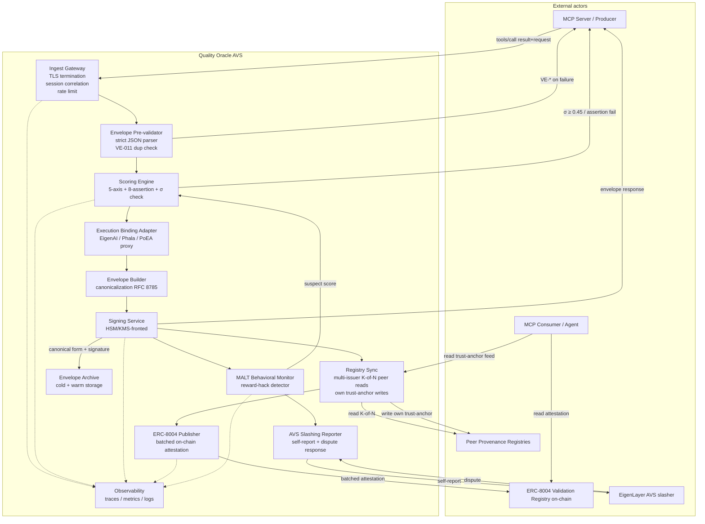
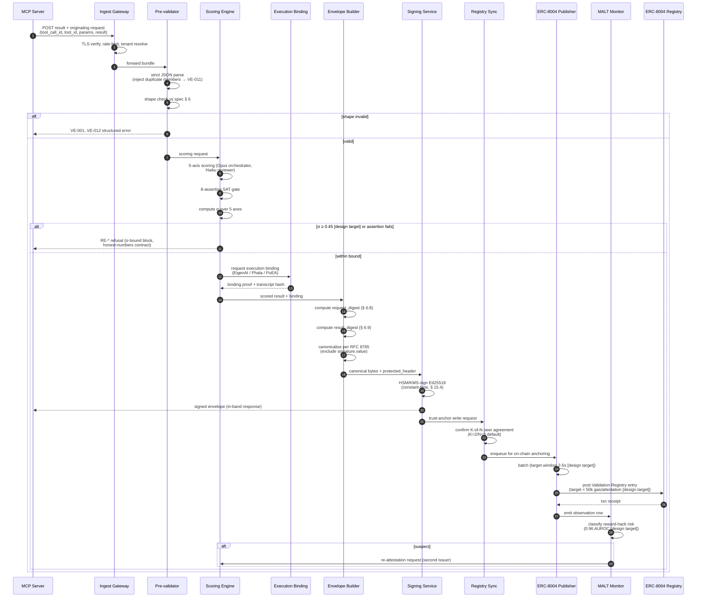

# Quality Oracle AVS — Architecture

**Status:** Stage-1 kickoff (worker T1 of `2026-05-13-quality-oracle-product`).
**Spec under implementation:** `state/specs/provenance-envelope/index-v2.1.mdx`.
**Author:** Enchanter Labs.
**Scope:** Architecture only. Tech-stack choices (T2), reference-implementation hardening (T3), challenge-bank governance, and AVS-wrapper economic design are out of scope and deferred to component sub-roadmaps.

> **Honest-numbers disclosure.** Every quantitative target in this document (latency, throughput, gas, MALT AUROC, σ-bound) is a **design target** — a number the architecture is shaped to meet — not a guarantee or a measured production figure. Targets are tagged `[design target]` at first use.

---

## 1. System overview

The Quality Oracle AVS is the deployable runtime through which Enchanter Labs implements the v2.1 Provenance Envelope specification at production scale. It is **not** the specification; the specification is the org-neutral contract. The AVS is the opinionated, EigenLayer-secured service that produces conforming envelopes, posts trust-anchor records, and stakes economic value behind its attestations.

The system sits between three classes of external actor and one on-chain settlement layer:

| Actor                        | Relationship to the AVS                                                                                  |
|------------------------------|---------------------------------------------------------------------------------------------------------|
| MCP Server (Producer)        | Submits `tools/call` request + result pairs. Receives a signed envelope or a structured failure code.   |
| MCP Consumer / Agent         | Reads envelopes from the response stream and/or reads attestations from the on-chain registry.          |
| Conforming Provenance Registry | Federated registries (multi-issuer median per spec § 12). The AVS operates one and reads from peers.   |
| ERC-8004 Validation Registry | On-chain settlement layer. The AVS writes Trust-Anchored attestations as Validation Registry entries.   |
| EigenLayer AVS slasher       | Restaked economic security. Slashes the AVS operator on σ-bound violations proven by dispute replay.    |

**Inputs.** A `tools/call` request payload (JSON-RPC params), a `tools/call` result payload (JSON-RPC result), session-level context (tenant DID, client identity proof if present), and the originating MCP server's tool-identity DID.

**Outputs.**
1. A v2.1-conforming Provenance Envelope returned to the MCP server in-band, **or** a structured failure response keyed to a VE/PE/RE error code from spec § 13 if the σ-bound or assertion gate blocks issuance.
2. An ERC-8004 Validation Registry attestation entry on-chain for envelopes that achieve Trust-Anchored level (spec § 10.3) and pass the σ-bound.
3. A MALT-class behavioral observation row in the off-chain attestation stream (consumed downstream by the behavioral monitor; see § 2).
4. An immutable archival row in the envelope archive.

**Operating contract.** The AVS commits to: producing conforming envelopes per spec § 6; gating on the Enchanter Labs convergence framework (5-axis scoring + 8-assertion gate + σ < 0.45); honoring multi-issuer K-of-N (default K=2/N=3) for its own Trust-Anchored writes; surfacing every refusal as a typed error code rather than a silent degradation (capability-fidelity / F22).

**Out of scope for the AVS itself.** The AVS does not provide the universe of challenges (handed off to the challenge bank — a stage-2 component), does not perform execution-binding (handed off to EigenAI / PoEA / Phala — see § 9), and does not own the org-neutral spec text.

---

## 2. Component diagram



| Component                  | Responsibility                                                                                          | Owned-by-Enchanter-Labs |
|----------------------------|--------------------------------------------------------------------------------------------------------|:------:|
| Ingest Gateway             | TLS termination per spec § 15.1; session correlation; per-tenant rate-limit; back-pressure              | yes    |
| Envelope Pre-validator     | Strict JSON parse (rejects duplicate members per § 15.12 → VE-011); shape check against spec § 6        | yes    |
| Scoring Engine             | 5-axis convergence scoring, 8-assertion SAT gate, σ check (< 0.45 [design target])                      | yes    |
| Execution Binding Adapter  | Proxies to chosen binding (EigenAI bit-exact, Phala TEE, or PoEA hardware-attested); collects proof     | adapter; binding itself is depend-on |
| Envelope Builder           | Produces canonical form per RFC 8785, including `request_digest` and `result_digest` (§ 6.8–6.9)         | yes    |
| Signing Service            | Computes signature via HSM/KMS-fronted key never exported to application memory; constant-time path     | yes    |
| Registry Sync              | Reads peer trust-anchor + revocation feeds (K-of-N, K=2 default); writes own; honors 24h freshness (§ 12.5) | yes (one node of a federation) |
| ERC-8004 Publisher         | Batches Trust-Anchored attestations, posts to Validation Registry; handles reorg / mempool stalls       | yes    |
| MALT Behavioral Monitor    | Consumes attestation stream; flags reward-hack signatures (0.96 AUROC [design target])                  | yes    |
| AVS Slashing Reporter      | Self-reports σ-bound violations to EigenLayer; responds to third-party disputes with replay artifacts   | yes    |
| Envelope Archive           | Append-only signed archive (warm: ≤ 90d hot reads; cold: indefinite immutability)                        | yes    |
| Observability              | Trace per tool-call; metrics on σ-distribution, registry K-of-N satisfaction, gas spend                  | yes    |

---

## 3. Per-tool-call lifecycle

The lifecycle below is the **happy path through Trust-Anchored attestation**. Failures branch out via VE-/PE-/RE- codes from spec § 13 and never silently substitute (capability-fidelity rule).



### Step-by-step contract

1. **Ingest.** Tenant resolved from session credentials; per-tenant token-bucket applied. Failure: PE-001 (rate limited).
2. **Pre-validate.** Strict JSON parser rejects duplicate members at every nesting level (spec § 15.12 / VE-011). Unknown fields are **retained** (spec § 15.16 / VE-012 only on explicit policy reject). Failure: VE-001..VE-012 surface to MCP as structured response.
3. **Score.** The convergence stack (a tier-aware Opus/Sonnet/Haiku pipeline) computes the 5 axes and the 8 assertions. σ over the 5 axes is computed exactly as defined in the DEPLOY bar in `CLAUDE.md`.
4. **σ-bound gate.** If σ ≥ 0.45 [design target] **or** any single assertion fails **or** any axis < 7.0, the AVS responds with an RE-* refusal. **This is the honest-numbers contract — no silent substitution, no inflation to clear the bar.**
5. **Execution-bind.** A binding proof is collected from the chosen substrate (EigenAI, Phala, or PoEA). The proof is incorporated into the envelope's `transformations` or a registered binding-attestation transformation per spec § 6.8 / § 14.
6. **Build.** `request_digest` and `result_digest` are computed before canonicalization (spec § 6.8 / § 6.9). Canonical form follows RFC 8785; `signature.value` is excluded; all other fields including `protected_header` are signed.
7. **Sign.** Signing key never leaves HSM/KMS boundary. Signature path is constant-time per spec § 15.4. Returned envelope is the in-band response to the MCP server, completing the producer-side contract.
8. **Register.** The trust-anchor record for `(tool_id, key_id)` is checked against K-of-N peers (default K=2/N=3 per spec § 12.6). If the AVS is the writing registry, it publishes its trust-anchor row with 24-hour `expires_at`.
9. **Anchor on-chain.** ERC-8004 Validation Registry entry is enqueued for batched publication. Batching window is short enough that p99 end-to-end (ingest → on-chain confirmed) holds at < 5s [design target].
10. **Monitor.** MALT observation is emitted per attestation. Suspect rows trigger re-attestation by a second issuer (spec § 15.6 multi-issuer mitigation operationalized).
11. **Archive.** Every envelope — including σ-blocked refusals — is archived. The archive is the substrate for replay-based dispute response (§ 4 below).

---

## 4. Trust model

This section enumerates the threats the **AVS** must defend against beyond the protocol-level mitigations the spec already mandates. Spec § 15 threats are not restated; this section identifies the deployment-level residuals.

### 4.1 Cross-reference to spec § 15

| Spec threat                         | Spec mitigation (already in conforming envelope)          | Additional AVS-deployment exposure                          |
|-------------------------------------|----------------------------------------------------------|------------------------------------------------------------|
| § 15.1 Envelope stripping           | TLS + `tools/list` advertisement + digests              | None added; AVS enforces by policy.                        |
| § 15.2 Replay (in-session)          | `tool_call_id` + entropy + session cache                | None added.                                                |
| § 15.3 Algorithm downgrade          | `protected_header.alg` signed                            | None added.                                                |
| § 15.4 Verification timing channel  | Audited constant-time library                           | The AVS signing path must also be constant-time; mirror obligation. |
| § 15.5 Producer key compromise      | Annual rotation + revocation                            | **AVS operator key compromise is now the AVS's central residual — see § 4.2 below.** |
| § 15.6 Trust-anchor capture         | Multi-issuer K-of-N                                     | The AVS is one of N; collusion among any K registries compromises it. See § 4.3. |
| § 15.7 Issuer cartel                | Commit-reveal + slashing                                | EigenLayer slasher is the AVS's accountability surface; slasher compromise is residual. See § 4.4. |
| § 15.8 Eval-awareness paradox       | Out-of-scope for spec; oracle MUST address              | **Quality Oracle owns this in full.** Mitigated via sealed-challenge rotation (stage-2 component) and MALT downstream. |
| § 15.9 Transformation laundering    | Registered semantic transformations only                | AVS enforces the registry locally; registry governance is a stage-2 sub-roadmap. |
| § 15.11 Unbound result substitution | `request_digest` + `result_digest`                       | None added; AVS implements the digests faithfully.          |
| § 15.12 Duplicate-member parser     | Strict parser, VE-011                                    | AVS must use one audited strict parser end-to-end; multiple parsers in the path introduce parser-differential risk between layers. |
| § 15.13 DID resolution poisoning    | TLS/SPKI pin + DNSSEC + `did_cache_ttl`                  | AVS must pin and bound TTL at the gateway and re-validate at signing; cache scope crosses processes. |
| § 15.14 Confused deputy             | `authz_context_digest` + session identity              | AVS must persist tenant boundaries across the scoring/binding/signing chain. |
| § 15.15 URL secret leakage          | Producer redacts; Registry MUST NOT log raw URLs        | AVS archive and observability stack must enforce the same — see § 4.5. |
| § 15.16 Forward compatibility       | Canonical form over full received object                | AVS pre-validator must NOT strip unknown fields.            |
| § 15.17 Multi-envelope ambiguity    | Independent per-envelope validation                     | AVS must independently log and not merge duplicate-`tool_call_id` envelopes. |
| § 15.18 Key-rotation fork replay    | `key_id`-pinned verification                             | AVS DID document retention policy must cover its own rotated keys for at least max(clock skew) + max(consumer cache TTL). |

### 4.2 Operator and KMS key compromise (AVS residual #1)

**Threat.** The signing key under operator control is the AVS's single most valuable asset. Compromise allows arbitrary Trust-Anchored envelope forgery for the duration of the revocation window.

**AVS mitigation.**
- Signing key never resides in application memory; lives only inside HSM/KMS. Application requests sign-by-handle.
- Geo-redundant signers (active/active or active/standby — § 5) share the same logical key via KMS replication, never via key export.
- Annual rotation per spec § 15.5 implemented as **gradual cutover**: new key registered in DID document, old key retained with `revoked_at` set far enough in the future to cover all consumers' cache TTLs (spec § 15.18 retention).
- KMS access policy enforces principal-of-least-privilege: only the signing service identity may invoke `Sign`; no human or CI principal may export, read, or rotate without two-person review.
- The signing service emits a per-signature audit log row (signed by a separate audit key) that pairs to the archived envelope; an attacker who steals the signing key would also need the audit key to suppress detection.

### 4.3 On-chain replay and ERC-8004 manipulation (AVS residual #2)

**Threat.** ERC-8004 entries posted by the AVS can be reorged out, front-run, or shadowed by a malicious registry contract. A reorged attestation can leave consumers reading stale state. A malicious registry deployment can mimic the canonical contract address and serve forged entries.

**AVS mitigation.**
- The ERC-8004 Publisher confirms only after N block-confirmations (N tuned to the target chain's finality assumptions; default 12 on Ethereum L1, higher on optimistic L2).
- On reorg detection, the publisher re-anchors the affected batch with a `supersedes` reference to the displaced txn. Off-chain envelope archive is the source of truth; on-chain is the public proof.
- Registry contract address is pinned per-deployment; the publisher refuses to anchor to any address not in its allowlist.
- Replay across chains is bounded by including the target chain ID inside the canonical attestation payload, not just at the EVM transaction level.

### 4.4 EigenLayer slasher compromise (AVS residual #3)

**Threat.** The slasher operator (or a quorum of slasher operators in the AVS-wrapper design) can refuse to slash a misbehaving issuer or, conversely, slash an honest issuer.

**AVS mitigation.**
- Public replay artifacts: every Trust-Anchored attestation links to its execution-binding proof. Third-party dispute requires re-running the binding plus the convergence scoring; both are deterministic given the artifacts in the envelope archive.
- The AVS itself participates as one of multiple slasher operators in the EigenLayer wrapper. Decisions follow median-of-K to mirror the registry-side multi-issuer model.
- Dispute window is long enough (target: 7 days [design target]) to allow third-party replay before slashing finalizes.
- Detailed slasher design is **a stage-2 sub-roadmap** and is out of scope here.

### 4.5 Logging-stack secret leakage (AVS residual #4)

**Threat.** Spec § 15.15 forbids logging raw `source.url` to public storage. The AVS's observability stack is the practical site where this rule is enforced or violated.

**AVS mitigation.**
- Pre-archive scrub pass: every envelope passes a structural redactor that strips known credential patterns from `source.url` before warm-storage write. Cold archive stores the unredacted envelope under separate access control.
- Observability traces never carry envelope payloads; only digests, error codes, and timing.
- Audit-log access is itself audited (meta-audit), and that meta-audit is the only path of accountability for operator self-exposure.

---

## 5. Deployment topology

The deployment is **cloud-agnostic** at the architecture level. Concrete component choices are deferred to T2; this section identifies the topology the architecture requires.

```
                +--------------------------+
   MCP clients  | Global edge (TLS, WAF,   |
   (geo-mixed)  | DDoS shield, anycast IP) |
                +-----+--------------+-----+
                      |              |
              +-------v---+      +---v--------+
              | Region A  |      | Region B   |   <- active/active; identical AVS plane
              | full AVS  |      | full AVS   |
              | plane     |      | plane      |
              +-+---------+      +---------+--+
                |  shared logical signing key (KMS-replicated; never exported)
                |
   +------------v------------------------------v------------+
   | Cross-region:                                          |
   |  - managed Postgres (envelope archive, multi-AZ + read |
   |    replicas in each region)                            |
   |  - object storage for cold archive (cross-region       |
   |    replicated, immutable / object-lock)                |
   |  - managed message queue (at-least-once, dedup by      |
   |    tool_call_id) for publisher batching                |
   +-----+-----------------------+--------------------------+
         |                       |
   +-----v------+         +------v------+
   | EVM RPC    |         | Observability|
   | pool (3+   |         | (OpenTelemetry|
   | providers, |         |  collector → |
   | active hot |         |  managed     |
   | failover)  |         |  backend)    |
   +-----+------+         +-------------+
         |
   +-----v-------------+
   | Ethereum / target |
   | chain (L1/L2)     |
   +-------------------+
```

| Layer                   | Topology requirement                                                                                                                                                |
|-------------------------|---------------------------------------------------------------------------------------------------------------------------------------------------------------------|
| Edge                    | Geo-anycast TLS termination; per-tenant rate-limit lives here.                                                                                                       |
| AVS plane               | Active/active across ≥ 2 regions. Stateless per request; horizontal scale by replica count.                                                                          |
| Signing                 | HSM- or KMS-fronted. Key replicated across regions via the managed KMS, never exported. Hot signer pool per region; warm standby in third region for DR.            |
| Envelope archive (warm) | Managed Postgres, multi-AZ, ≥ 90-day hot retention. Schema indexed on `(tool_call_id, invoked_at, tool_id)`.                                                         |
| Envelope archive (cold) | Object storage with object-lock / WORM semantics. Cross-region replication mandatory. Retention indefinite.                                                          |
| Message queue           | At-least-once delivery; dedup by `tool_call_id`. Powers publisher batching and MALT fan-out.                                                                          |
| EVM RPC                 | Pool of ≥ 3 providers (two managed: e.g., one of Alchemy/Infura/QuickNode plus another; one self-hosted). Hot-failover. Per-provider per-second rate budget tracked. |
| Observability           | OpenTelemetry collectors per region; export to a managed backend (e.g., Datadog or Honeycomb tier). Logs PII-scrubbed at collector boundary.                          |
| Secret management       | Managed secrets store for all non-signing credentials; signing keys exclusively in KMS/HSM.                                                                          |
| DR                      | RPO ≤ 1 minute on envelope archive; RTO ≤ 15 minutes on full-plane failure. Cold archive is the eventual source of truth.                                            |

---

## 6. On-chain interaction model

### 6.1 Read paths

| Read                                            | Source                                                       | Cache discipline                                                       |
|-------------------------------------------------|--------------------------------------------------------------|-----------------------------------------------------------------------|
| Trust-anchor record for `(tool_id, key_id)`     | ERC-8004 Validation Registry + K-1 peer registries           | 24h max age per spec § 12.5; force-refresh at boundary.                |
| Revocation record for `key_id`                  | Same                                                         | Same; revocation strictly dominates trust-anchor (spec § 12.6 step 4). |
| DID document for `tool_id`                      | `did:web` HTTPS or `did:key` inline                          | `did_cache_ttl` (default 300s per spec § 15.13).                       |
| Peer registry feed                              | HTTPS endpoint of K-1 peer Conforming Provenance Registries  | 24h freshness; signature verified before cache.                         |

### 6.2 Write paths

| Write                                           | Target                              | Frequency                                                       |
|-------------------------------------------------|-------------------------------------|----------------------------------------------------------------|
| Validation Registry attestation                 | ERC-8004 contract on target chain   | Batched (see below); one entry per envelope that reaches Trust-Anchored. |
| Own trust-anchor row (`tool_id`, `key_id`)      | AVS's own registry endpoint (off-chain HTTPS feed) | On key rotation; on tool onboarding; on revocation event. |
| Own revocation row                              | Same                                | On compromise detection; on operator-initiated key retirement.   |

### 6.3 Gas budget

**Target: < 50,000 gas per attestation [design target].**

The architecture leans on three levers to hit this target:

1. **Batched anchoring.** Multiple attestations packed into a single transaction. The per-attestation gas falls roughly as `(fixed_txn_overhead / batch_size) + per_entry_storage`. Batch window: 2–5 seconds [design target] to preserve the < 5s end-to-end p99.
2. **Compact entry encoding.** The on-chain entry stores a content hash + minimal metadata; the full envelope lives in the off-chain archive. Reads dereference via the hash.
3. **Calldata over storage where possible.** Use EIP-4844 blob calldata on chains that support it for batch payloads; reserve contract storage for the small index.

### 6.4 Failure modes and recovery

| Failure                       | Detection                                  | Recovery                                                                                  |
|-------------------------------|--------------------------------------------|------------------------------------------------------------------------------------------|
| RPC provider outage           | Per-provider health checks                 | Failover to next-priority RPC in pool; circuit-break stuck provider for 60s [design target]. |
| Mempool stall (txn pending)   | Stuck-tx watchdog (> 2× batch window)      | Re-broadcast with bumped gas; if still stuck, replace-by-fee with cancel and re-batch.    |
| Chain reorg                   | Block-confirmation watcher                 | Re-anchor displaced batch with `supersedes` reference. Off-chain archive is source of truth. |
| Registry contract upgrade     | Address pin mismatch on next read          | Halt writes; require operator-acknowledged config update; emit operator alert.            |
| Total chain unavailability    | Multi-RPC failure                          | Continue producing Cryptographically Valid envelopes (spec § 10.2); withhold Trust-Anchored claim until anchoring resumes. **Critically: do not silently downgrade — surface validation level to the consumer.** |

---

## 7. Scaling considerations

**Design target: 100 attestations/sec sustained, p99 ingest-to-on-chain confirmed < 5s.** Both numbers are aspirational and the architecture is shaped to meet them; neither is guaranteed.

### 7.1 Per-stage cost and the dominant bottleneck

| Stage                       | Latency contribution                                | Throughput ceiling (per replica)                  |
|-----------------------------|----------------------------------------------------|--------------------------------------------------|
| Ingest + pre-validate       | low (≤ 5ms [design target])                         | high (thousands/sec)                              |
| Scoring engine              | **dominant** (LLM round-trips for Opus + Haiku)     | bound by Opus/Sonnet/Haiku rate limits and concurrency  |
| Execution binding           | medium-high (EigenAI bit-exact replay overhead ~1.8% per the v2 brief; TEE attestation adds round-trip) | bound by binding-substrate capacity              |
| Envelope build + sign       | low (≤ 10ms [design target] including KMS round-trip) | high (limited by KMS call ceiling)                |
| Registry sync + on-chain    | medium (batching window 2–5s)                       | high (governed by RPC pool capacity)              |
| MALT monitor                | async (off the critical path)                       | independent                                       |

The **scoring engine** is the bottleneck. The 5-axis + 8-assertion stack invokes the LLM tier ladder. Even with aggressive caching and tier discipline, a cold scoring path costs hundreds of milliseconds and tens of cents of tokens.

### 7.2 Scaling levers

1. **Horizontal scale the scoring pool.** Stateless workers behind a queue. Linear scale until the LLM provider rate limits bite; at that point provision additional concurrency keys or shift load across providers.
2. **Tier discipline.** Opus only for orchestration / judgment; Haiku for reviewer / validator (per `CLAUDE.md` agent-tier table). Routing a Haiku task to Opus burns budget AND blocks the bottleneck.
3. **Signature caching for re-attestation.** A re-attestation of an unchanged `(request_digest, result_digest, tool_id, tool_version)` tuple can short-circuit to a cached score + fresh signature. Cache TTL bounded by tool-version semver discipline.
4. **Off-chain batching with on-chain anchoring.** The on-chain layer batches per § 6.3; signature load is paid per envelope but on-chain settlement is paid per batch.
5. **Asynchronous MALT.** Behavioral monitoring is off the critical path; suspect findings trigger re-attestation but do not block the original response.
6. **Stateless gateway.** The ingest gateway is per-request stateless beyond the rate-limit token bucket; trivially horizontally scaled.

### 7.3 Capacity headroom

The architecture targets ≥ 3× headroom over the 100 att/s [design target] at each stateless stage. The signing service is provisioned for ≥ 2× peak; KMS is the constraint that may force re-architecture (e.g., key-handle pool) if the throughput target rises by an order of magnitude.

---

## 8. Operational boundaries

The AVS is intentionally a **thin sovereign layer** on top of well-understood depend-on substrates. The boundary discipline below preserves operator focus and limits the surface area Enchanter Labs commits to maintaining.

### 8.1 Enchanter Labs operates

| Component                  | Why owned                                                                                  |
|----------------------------|-------------------------------------------------------------------------------------------|
| Ingest gateway             | Tenant policy and rate-limit are AVS-specific; commodity ingress alone is insufficient.    |
| Envelope pre-validator     | Strict-parser correctness is a security-critical AVS property (spec § 15.12).               |
| Scoring engine             | The 5-axis + 8-assertion stack is the core Enchanter Labs IP; honest-numbers contract.     |
| Envelope builder + signer  | Canonicalization correctness and signing-path constant-time are AVS-controlled.            |
| Conforming Provenance Registry node | The AVS operates one of the N registries in the federation.                          |
| MALT behavioral monitor    | The 0.96 AUROC [design target] classifier and its training data lifecycle.                   |
| AVS slashing reporter      | Self-reporting + dispute response artifacts.                                                |
| Envelope archive           | Source of truth for dispute replay.                                                          |
| Observability instrumentation | PII-scrubbing rules per spec § 15.15.                                                     |

### 8.2 Enchanter Labs depends on

| Dependency                       | Trust assumption                                                                                  | Failure mode                                                |
|----------------------------------|---------------------------------------------------------------------------------------------------|------------------------------------------------------------|
| EigenLayer (slashing, restake)   | Slasher quorum is honest; restaked stake is liquid                                                | AVS slashing reporter degrades to advisory; spec § 15.7 applies. |
| ERC-8004 Validation Registry     | Canonical contract address is authentic; on-chain semantics stable across upgrades                | AVS halts writes on detected upgrade until config updated.   |
| EVM RPC providers                | Pool of ≥ 3 providers, no two controlled by same entity                                            | Failover; circuit-break stuck provider.                       |
| MCP servers                      | Compliant to spec § 6 ingestion contract                                                          | Pre-validator rejects malformed input with structured error.   |
| Peer Conforming Provenance Registries | K-of-N (K=2/N=3 default) honest; signatures verifiable                                       | Trust-Anchored writes withheld; spec § 12.6 step 3 applies.    |
| Execution-binding substrate (EigenAI / Phala / PoEA) | Binding proofs are cryptographically valid and replay-reproducible                      | Envelope falls back to Cryptographically Valid; no Trust-Anchored claim. |
| Managed Postgres / object storage / KMS | Hyperscaler SLAs + cross-region replication                                                  | DR plan engages; cold archive is the recovery basis.           |
| LLM providers (Opus / Sonnet / Haiku) | Rate-limited but available; pricing stable enough for cost contract                            | Tier ladder spreads load; scoring engine queues spill to retry. |

---

## 9. Open questions for stage-2 sub-roadmaps

The decisions below are **deferred** to per-component sub-roadmaps. They are surfaced here so the Stage-1 architecture does not bake a premature commitment.

| # | Question                                                                                              | Owning sub-roadmap                              | Decision deadline                                         |
|---|-------------------------------------------------------------------------------------------------------|-------------------------------------------------|----------------------------------------------------------|
| 1 | **Challenge-bank governance.** Foundation-curated for v0 (faster, lower threat surface during pilot) vs. commit-reveal permissionless from day one (better long-term legitimacy, higher launch complexity)? | `challenge-bank` sub-roadmap                    | Before Month 3 of the 6-month plan (`brief-v2.md` § 6-month ship plan). |
| 2 | **Execution-binding substrate.** EigenAI (deterministic, bit-exact, 1.8% overhead per `brief-v2.md`) vs. Phala (TEE, simplest to integrate, most expensive to replicate independently) vs. PoEA (hardware-attested trace, most general, newest, $0.07/query per the brief). The brief's recommendation is EigenAI-first + Phala-fallback, but the AVS Execution Binding Adapter must remain swappable. | `execution-binding` sub-roadmap                  | Before Month 5 (pilot + execution binding).                |
| 3 | **MALT classifier selection.** The 0.96 AUROC [design target] is the published METR figure for a specific model architecture and dataset (10,919 transcripts, Oct 2025 per `brief-v2.md`). Which classifier the AVS actually ships, how it is fine-tuned for the AVS's attestation stream, and how its drift is monitored over time are open. | `malt-monitor` sub-roadmap                       | Before Month 6 (economic security + behavioral monitoring). |
| 4 | **K-of-N registry federation parameters.** K=2/N=3 is the spec's recommended baseline. Whether the AVS ships at the baseline or with a stricter K, and the identity of peer registries at launch, is open. | `registry-federation` sub-roadmap                | Before Month 4 (pilot prep).                                |
| 5 | **AVS-wrapper economic design.** Slashing magnitude, dispute window length, multi-issuer-median K, restaker-to-operator ratio. The brief mentions median-of-K and 7-day dispute window [design target] but the parameter set is a sub-roadmap. | `avs-wrapper` sub-roadmap                        | Before Month 6.                                              |
| 6 | **Cross-chain anchoring.** Whether to anchor Validation Registry entries on Ethereum L1, an L2 (Base for x402 / UFX adjacency per `brief-v2.md`), or multi-chain. The brief notes [agentarena.site](https://agentarena.site) reports agents across 17 blockchains. | `on-chain-publishing` sub-roadmap                | Before Month 2 (substrate + capability fidelity).            |
| 7 | **Re-attestation policy.** When MALT flags a suspect score, which second issuer is invoked, with what isolation, and how the two outcomes are reconciled in the attestation stream. | `malt-monitor` + `registry-federation` jointly  | Before Month 6.                                              |
| 8 | **Tenant-isolation strength.** Whether the convergence stack runs in per-tenant isolation (stronger but costlier) or shared with logical tenancy (cheaper, broader confused-deputy surface per spec § 15.14). | `multi-tenancy` sub-roadmap                      | Before any production tenant beyond the pilot.               |

---

## Appendix A — Notation

- **AVS** — Actively Validated Service (EigenLayer term for a restaked-secured service).
- **MALT** — Monitoring And Labeling Transcripts; the METR-released reward-hacking detection dataset (10,919 labeled transcripts, October 2025) and the classifier family trained on it.
- **σ-bound** — standard deviation across the 5 axes of the convergence score; the DEPLOY bar is σ < 0.45.
- **K-of-N** — K registries out of N consulted must produce concordant trust-anchor records before Trust-Anchored validation succeeds (spec § 12.6).
- **Design target** — an aspirational engineering number the architecture is shaped to meet; not a measured production figure, not a guarantee.
