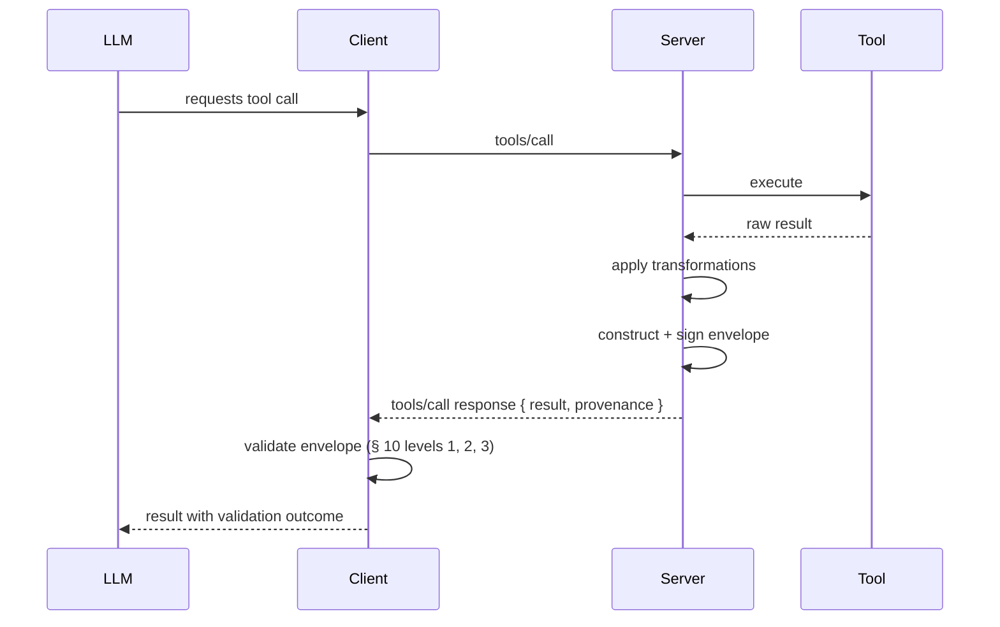
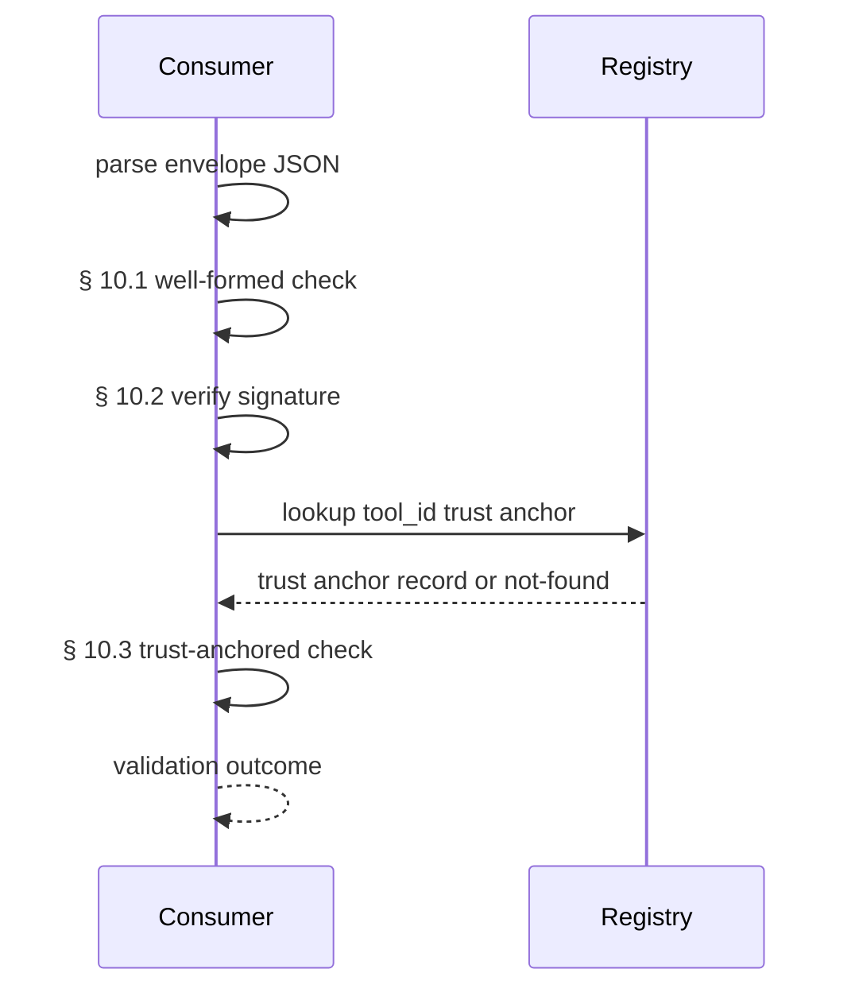

<div id="enable-section-numbers" />

# Tool-Call Provenance Envelope

## Conventions

The key words **MUST**, **MUST NOT**, **REQUIRED**, **SHALL**, **SHALL NOT**, **SHOULD**, **SHOULD NOT**, **RECOMMENDED**, **NOT RECOMMENDED**, **MAY**, and **OPTIONAL** are to be interpreted as described in BCP 14 [[RFC2119]] [[RFC8174]]. This interpretation applies when, and only when, the key words appear in all capitals, as shown here.

A **Conforming Envelope Producer** is an MCP server implementation that emits provenance envelopes alongside tool-call results per the requirements in §§ 6, 7, 9.

A **Conforming Envelope Consumer** is an MCP client implementation that retrieves, validates, and acts on provenance envelopes per the requirements in §§ 6, 10.

A **Conforming Provenance Registry** is a service that publishes trust-anchor metadata per the requirements in §§ 11, 13.

A **tool-call** is a single invocation of an MCP `tools/call` request as defined in [[MCP-2025-11-25]] § Server Features / Tools.

A **provenance envelope** is a signed JSON object. It binds a tool-call identifier to the identity of the producing agent, the source of the data, and the transformations applied between source and result.

A **canonical form** of a JSON object is its serialization under [[RFC8785]] JSON Canonicalization Scheme.

A **profile identifier** is a string of the form `mcp-provenance/{date}-{algorithm-suite}` that identifies the envelope version and signature algorithm; see § 11.
## Abstract

*This section is non-normative.*

The Tool-Call Provenance Envelope is a signed JSON assertion. It binds a tool-call identifier to the identity of the producing agent, the sources of the data, and the transformations applied between source and result. The envelope additionally carries cryptographic digests of the originating request and the resulting content, sealing the input-output relationship the envelope attests. Producers, consumers, and registries form the three conformance classes defined in § 5.

## Motivation

*This section is non-normative.*

The Model Context Protocol [[MCP-2025-11-25]] defines how agents invoke tools and receive structured results. The current trust model is implicit: a client trusts a server by virtue of being connected. After a tool-call completes, there is no after-the-fact mechanism for a third party to verify what a specific tool returned, when, from which source, or under whose authority.

The 2026 deployment reality has outgrown this trust model. ERC-8004 contracts went live on Ethereum mainnet on 2026-01-29, and [8004scan.io](https://8004scan.io) reports more than 192,000 registered agents across 30 networks as of May 2026 [[8004scan-2026-05]]. The x402 payment protocol [[x402-Foundation]] has processed approximately 165 million transactions and approximately 50 million United States Dollars in cumulative volume by late April 2026. Payments flow to autonomous agents through 22 founding members including AWS, Stripe, Visa, and Circle. Agents are now economic actors handling real value, yet no payment in this graph carries a verifiable signal of which tool produced which result.

Adjacent verification stacks address only part of the gap. Verifiable-inference systems such as EigenAI, Gensyn Delphi, Ritual Infernet, and Optimistic TEE-Rollups verify execution integrity — that is, that the computation ran correctly on the declared model. They do not score output quality, and they do not bind the result to a specific tool-call identifier in the MCP message stream. Reputation systems such as TraceRank and AgentRank propagate trust through payment-graph endorsements, not through structured assertions about result origin. Mira Network reaches multi-model consensus on factual claims and writes certificates to Base L2, but the consensus is over content rather than over which model produced which result.

The Tool-Call Provenance Envelope occupies the empty slot between these systems. It does not score quality. It does not verify computation. It records, signs, and makes verifiable the four facts that today flow through MCP unsigned: which tool produced this result, who invoked it, when, and from which source. Quality oracles and trust scoring sit above the envelope, consuming it as input.
## Overview

*This section is non-normative.*

A tool-call lifecycle with provenance proceeds as follows. The client invokes `tools/call` with a tool name and arguments, including a client-generated `tool_call_id`. The server executes the tool and retrieves the source data (potentially from multiple upstream sources). It applies any post-processing transformations and constructs a provenance envelope by populating the fields defined in § 6. The server computes the canonical form of the envelope (with `signature.value` absent) under [[RFC8785]] and signs the canonical bytes with its private key. It then attaches the resulting envelope to the `tools/call` response in the `provenance` field. The client validates the envelope at three progressive levels — syntactically well-formed, cryptographically valid, and trust-anchored — and proceeds based on its policy for each level.

A complete envelope appears below.

```json theme={null}
{
  "result": {
    "content": [
      { "type": "text", "text": "The Eiffel Tower is 330 meters tall." }
    ]
  },
  "provenance": {
    "version": "mcp-provenance/2026-05-13-ed25519",
    "tool_call_id": "tc_01HXYZK4Q7M9N1J5R8B2C6D3E0",
    "tool_id": "did:web:example.com:tools:wiki-search",
    "tool_version": "1.4.2",
    "invoked_at": "2026-05-13T14:23:11.412Z",
    "invoked_by": "did:agent:0xf3a9c2...",
    "request_digest": "sha-256:9b1f6e3a4c2d5f8e0a7b6c1d2e3f4a5b6c7d8e9f0a1b2c3d4e5f6a7b8c9d0e1f",
    "result_digest": "sha-256:2c4e8a1b5d7f3e9c0a2b4d6f8e1c3a5b7d9f1e3c5a7b9d1f3e5c7a9b1d3f5e7c",
    "sources": [
      {
        "type": "web",
        "url": "https://en.wikipedia.org/wiki/Eiffel_Tower",
        "retrieved_at": "2026-05-13T14:23:10.998Z",
        "hash": "sha-256:7a3f...c1e2",
        "weight": 0.7
      },
      {
        "type": "web",
        "url": "https://www.toureiffel.paris/en/the-monument/key-figures",
        "retrieved_at": "2026-05-13T14:23:11.054Z",
        "hash": "sha-256:4b2c...d9a8",
        "weight": 0.3
      }
    ],
    "transformations": ["summarized_by_gpt5"],
    "confidence": 0.87,
    "signature": {
      "protected_header": {
        "alg": "Ed25519",
        "key_id": "did:web:example.com#keys-1"
      },
      "value": "B6jx5KqVl9oP2nW1mE0sZ4hY7tR8kU3vJ6f..."
    }
  }
}
```

<Info>
This example is illustrative. The normative field requirements are in § 6. The signature value, source hashes, and digests in this example are truncated or synthetic and are not valid cryptographic outputs.
</Info>

Reading the example top to bottom: the outer `result` object is the standard MCP tool-call result content from [[MCP-2025-11-25]]; the `provenance` object is the addition this specification defines. The `version` field declares which envelope profile this object conforms to. The `tool_call_id` field carries the identifier the Client generated for the originating `tools/call` request, which the Producer has echoed verbatim. The `tool_id` and `tool_version` fields identify the tool implementation that produced the result. The `invoked_at` and `invoked_by` fields record when the tool ran and who invoked it. The `request_digest` and `result_digest` fields bind the envelope to the specific request parameters and result content; without these digests, a valid envelope could be reattached to altered content. The `sources` array describes the upstream origins of the data. The `transformations` array lists the post-source transformations applied in order. The `confidence` field is the Producer's self-reported confidence; it is informative only. The `signature.protected_header` object carries the signature algorithm and key identifier; both are covered by the signature because only `signature.value` is excluded from the canonical form. The `signature.value` is the cryptographic signature over that canonical form.

## Conformance

The Tool-Call Provenance Envelope defines three conformance classes.

### Conforming Envelope Producer

A Conforming Envelope Producer **MUST** satisfy the requirements in §§ 6, 7, 9 of this specification.

### Conforming Envelope Consumer

A Conforming Envelope Consumer **MUST** satisfy the requirements in §§ 6, 10 of this specification.

### Conforming Provenance Registry

A Conforming Provenance Registry **MUST** satisfy the requirements in §§ 11, 13 of this specification.

### All Conformance Classes

All implementations **MUST** support the JSON serialization of the envelope as defined in § 6. All implementations **MUST** support the Ed25519 signature algorithm as defined in [[RFC8032]]. Implementations **MAY** additionally support the ECDSA P-256 signature algorithm as defined in [[RFC6979]]. Implementations **MAY** additionally support the CBOR serialization as defined in Appendix A.2.
## Envelope Structure

This section defines the normative envelope structure. Every Conforming Envelope Producer **MUST** emit envelopes that conform to the field requirements in this section. Every Conforming Envelope Consumer **MUST** validate envelopes against the field requirements in this section before treating an envelope as syntactically well-formed.

### 6.1 Field Summary

| Field | Type | Required | Description | COSE Label |
|---|---|---|---|---|
| `version` | string | yes | Profile identifier; see § 11. | 1 |
| `tool_call_id` | string | yes | Identifier of the originating tool-call, generated by the Client and echoed by the Producer; see § 6.3. | 2 |
| `tool_id` | string (DID) | yes | Decentralized Identifier of the invoked tool. | 3 |
| `tool_version` | string (semver) | yes | Semantic version of the tool that produced the result. | 4 |
| `invoked_at` | string (RFC 3339) | yes | UTC timestamp of invocation. | 5 |
| `invoked_by` | string (DID) | yes | Decentralized Identifier of the invoking agent. | 6 |
| `request_digest` | string | yes | Digest over the canonical form of the originating `tools/call` request parameters; see § 6.8. | 7 |
| `result_digest` | string | yes | Digest over the canonical form of the `tools/call` result content; see § 6.9. | 8 |
| `sources` | array of objects | yes | One or more upstream sources of the data; see § 6.10. | 9 |
| `transformations` | array of strings | no | Ordered list of post-source transformations applied. | 10 |
| `confidence` | number (0..1) | no | Producer self-reported confidence; informative only. | 11 |
| `signature` | object | yes | Container for `protected_header` (signed) and `value` (excluded from canonical form). See § 6.13. | 12 |

The `signature` field is the only top-level field excluded from the canonical form during signing and verification. All other fields, including `protected`, are signed. The exclusion rule is normative and is specified in § 9.

### 6.2 `version`

The `version` field **MUST** be a string of the form `mcp-provenance/{date}-{algorithm-suite}`. The `{date}` component **MUST** match the MCP protocol version that introduced or last revised this envelope specification, formatted as `YYYY-MM-DD`. The `{algorithm-suite}` component **MUST** identify the signature algorithm in lowercase ASCII without separators, drawn from the Profile Identifier registry defined in § 11. A Producer **MUST** set `version` to a profile identifier listed in the registry. A Consumer **MUST** reject envelopes whose `version` is not present in its supported-profiles list with error code `VE-001`.

### 6.3 `tool_call_id`

The `tool_call_id` field **MUST** be a non-empty ASCII string that uniquely identifies the originating tool-call request within the session.

**Client ownership.** The Client **MUST** generate the `tool_call_id` and **MUST** include it in the `tools/call` request parameters. The parameter is carried in the MCP request envelope; the registration mechanism is defined by the MCP capability negotiation extension referenced in § 16. The generated value **MUST** carry at least 96 bits of cryptographic entropy and **MUST NOT** collide with any prior `tool_call_id` observed by the Client within the current session.

**Producer echo.** The Producer **MUST** copy the `tool_call_id` from the originating `tools/call` request into the envelope verbatim. The Producer **MUST NOT** rewrite, normalize, truncate, or regenerate the value. If the originating request did not carry a `tool_call_id`, the Producer **MUST NOT** emit an envelope for that tool-call. In that case the Producer **MUST** return protocol error `PE-002a` (session boundary error) per § 13.

**Consumer check.** A Consumer **MUST** reject envelopes whose `tool_call_id` does not match the value the Consumer generated for the originating request with error code `VE-002`. A Consumer **MUST NOT** accept an envelope solely because its `tool_call_id` matches some prior session value; the match **MUST** be against the specific call awaiting validation.

This ownership model aligns with the MCP base specification, in which the Client is the originator of `tools/call` and the Server is the responder.

### 6.4 `tool_id`

The `tool_id` field **MUST** be a string conforming to the Decentralized Identifier syntax as defined in [[DID-CORE]]. A Producer **MUST** set this field to a Decentralized Identifier under its control that resolves to a DID document containing the public key identified by `signature.protected_header.key_id` (§ 6.13). A Consumer **MUST** reject envelopes whose `tool_id` does not resolve to a DID document, with error code `VE-003`. A Consumer **MUST** also reject envelopes whose resolved DID document does not contain the `signature.protected_header.key_id` referenced by the envelope, with error code `VE-003`.

### 6.5 `tool_version`

The `tool_version` field **MUST** be a string conforming to Semantic Versioning 2.0.0 as defined in [[SEMVER]]. A Producer **MUST** set this field to the released version of the tool implementation that produced the result. A Producer **MUST NOT** set this field to a placeholder value such as `0.0.0` or `dev`. A Consumer **SHOULD** accept any value that parses as valid Semantic Versioning, including pre-release and build-metadata variants; rejection on version content is a policy decision outside this specification.

### 6.6 `invoked_at`

The `invoked_at` field **MUST** be a string conforming to the date-time format defined in [[RFC3339]], expressed in Coordinated Universal Time. Sub-second precision is **OPTIONAL**; see § 15 for the privacy guidance that motivates this softening from the v1 mandate. A Producer **MUST** set this field to the time at which the tool began execution, measured at the Producer's clock. A Consumer **MAY** reject envelopes whose `invoked_at` differs from the Consumer's clock by more than a Consumer-policy tolerance with error code `VE-004`. The tolerance is a Consumer policy parameter; the non-normative default is 300 seconds.

### 6.7 `invoked_by`

The `invoked_by` field **MUST** be a string conforming to the Decentralized Identifier syntax as defined in [[DID-CORE]]. The field identifies the agent that issued the originating `tools/call` request.

A Producer **MUST NOT** populate this field from a value supplied directly in the `tools/call` arguments object or from any other unauthenticated channel. A Producer **MUST** derive this field from one of the following sources, in declining order of trust:

1. **ClientIdentityProof.** When the Client supplied a `_meta._provenance.client_identity` block conforming to § 6.7.1, and the Producer verified the proof per § 6.7.2, the Producer **MUST** set `invoked_by` to the `agent_did` carried in that proof.
2. **Transport-layer authenticated identity.** When the underlying transport carries an authenticated identity (an OAuth 2.0 access token whose subject is a DID-bearing claim, or a mutual-TLS client certificate bound to a DID via a registered binding), the Producer **MAY** set `invoked_by` to that DID, provided the Producer has independently verified the binding.
3. **Producer policy default.** When neither of the above is available, the Producer **MAY** omit `invoked_by` (in which case the envelope's trust level is reduced per § 10.3, and a Consumer **MUST NOT** treat the envelope as Trust-Anchored for any claim that depends on agent identity), or **MAY** populate it with a placeholder DID controlled by the Producer that explicitly signals "agent-identity-unverified" (a DID method **MUST** be registered for this purpose in § 14; the suggested method is `did:enchanter:unverified` until a base-spec-registered placeholder exists).

A Producer **MUST NOT** assert any other source for `invoked_by`. In particular, the Producer **MUST NOT** infer the agent identity from request payload heuristics, from the client's IP address, from a User-Agent string, or from any field of the Client's choosing that has not been signed by a key resolvable from the claimed DID document's `authentication` verification relationship.

A Consumer **MUST** reject envelopes with `VE-005` when the Consumer holds independent evidence (from its own session records, its `ClientIdentityProof` capability negotiation, or its policy configuration) that the `invoked_by` value does not correspond to the agent that issued the originating request. A Consumer's enforcement is no longer the sole gating mechanism — it is now a backstop to Producer-side verification, not a substitute for it.

The `ClientIdentityProof` mechanism (§ 6.7.1, § 6.7.2) is an Enchanter Labs extension to the MCP base specification under the `_provenance.client_identity` namespace. It is the recommended mechanism for satisfying clause (1) above. A future revision of MCP that incorporates an equivalent mechanism into the base specification **MUST** be preferred over this extension once available.

(Sub-sections § 6.7.1 "ClientIdentityProof envelope" and § 6.7.2 "Verification procedure" contain the field-shape and the seven-step verification procedure from this document, lifted verbatim with normative MUST/SHOULD language. They are not reproduced here to keep this section to the prose contract — c7 will inline them when synthesizing v2.1.)

### 6.7.1 ClientIdentityProof envelope

The full normative definition of the `_meta._provenance.client_identity` block — including the seven-field shape (`v`, `agent_did`, `tenant_id` optional, `proof` containing `typ`, `alg`, `jws`, `kid`) and the JWS claim set (`iss`, `aud`, `iat`, `exp`, `jti`, `htm`, `htn`, `rdg`, `tnt`, `srv_nonce`) — is defined in the Enchanter Labs design document `state/roadmaps/2026-05-13-close-remaining-gaps/c5-output.md` § "Mechanism: ClientIdentityProof". A future revision of this specification **MUST** inline that text once the upstream MCP SEP for ClientIdentityProof is opened.

### 6.7.2 Verification procedure

The Producer's seven-step verification procedure for a ClientIdentityProof is defined in the same design document, § "Verification procedure". A Producer that implements this extension **MUST** execute every step in order before populating `invoked_by`. A Producer that cannot verify any step **MUST NOT** populate `invoked_by` from the proof and **MUST** fall back to clause (3) of § 6.7.

### 6.8 `request_digest`

The `request_digest` field **MUST** be a string of the form `{algorithm}:{hex}`. The `{algorithm}` component **MUST** be `sha-256` or a value registered in the Digest Algorithm registry (§ 14). The `{hex}` component is the lowercase hexadecimal encoding of the digest bytes. The Producer **MUST** compute the digest over the canonical form (per [[RFC8785]]) of the `params` object of the originating `tools/call` JSON-RPC request, encoded as UTF-8 bytes prior to digesting. A Consumer **MUST** independently compute the same digest over the request `params` it sent and **MUST** reject envelopes whose `request_digest` does not match with error code `VE-009` (request digest mismatch).

This field binds the envelope to the specific request the Client issued. Without this binding, a valid envelope from one request could be reattached to a different request with matching metadata; see § 15 (Unbound Result Substitution).

### 6.9 `result_digest`

The `result_digest` field **MUST** be a string of the form `{algorithm}:{hex}` under the same algorithm registry and encoding rules as `request_digest` (§ 6.8). The Producer **MUST** compute the digest over the canonical form (per [[RFC8785]]) of the `result` object of the corresponding `tools/call` JSON-RPC response, encoded as UTF-8 bytes prior to digesting. The `result` object covered by the digest is the same object that ships in the response alongside the envelope; the digest **MUST NOT** cover the `provenance` field itself.

A Consumer **MUST** independently compute the digest over the `result` object as observed in the response. A Consumer **MUST** reject envelopes whose `result_digest` does not match, with error code `VE-010` (result digest mismatch).

This field binds the envelope to the specific result returned. Combined with `request_digest`, the pair seals the input-output relationship the envelope attests.

### 6.10 `sources`

The `sources` field **MUST** be a non-empty JSON array. Each element **MUST** be a JSON object with the structure below. The array **MUST** be ordered to reflect the Producer's declared aggregation order; the order is informative for Consumers but normative for canonicalization.

| Sub-field | Type | Required | Description |
|---|---|---|---|
| `type` | string | yes | One of `web`, `database`, `user`, `llm`, `tool`, `sensor`, or a value registered in the Source Type registry (§ 14). |
| `url` | string | conditional | **REQUIRED** when `type` is `web` or `database`; **MUST** be a URI conforming to [[RFC3986]]. |
| `retrieved_at` | string (RFC 3339) | yes | UTC timestamp of source retrieval. |
| `hash` | string | no | Content hash of the source data, formatted as `{algorithm}:{hex}`. |
| `weight` | number (0..1) | no | Producer-declared contribution weight; informative only. |

A Producer **MUST** populate each source element with the upstream origin of the corresponding data, not an intermediate cache. A Producer **MUST** include every distinct upstream source that materially contributed to the result. For tools that aggregate multiple sources (retrieval-augmented generation, multi-document summarization, federated search, SQL aggregation), each contributing source **MUST** appear as a separate array element.

A Producer that produced a result without an external source (a purely generative model output, for example) **MUST** include a single `sources` element with `type: "llm"` describing the generating model. The field **MUST NOT** be an empty array; the absence of an external source is itself a source claim.

A Consumer **SHOULD** verify each `sources[i].hash` when present. Verification of `sources[i].hash` is a prerequisite for treating the corresponding source as contributing to a Trust-Anchored validation level per § 10.3. Sources whose hash is absent or unverified do not contribute to that level for that source's bound claims.

### 6.11 `transformations`

The `transformations` field, when present, **MUST** be an array of non-empty strings. Each string **MUST** name a transformation applied between source retrieval and envelope construction, ordered from earliest to latest application. Transformation names **MUST** match entries in the Transformation registry defined in § 14 or use the experimental prefix `x-` for transformations not yet registered. A Producer that applied no transformations **MAY** omit this field or set it to an empty array.

### 6.12 `confidence`

The `confidence` field, when present, **MUST** be a number in the closed interval `[0.0, 1.0]`. A Producer **MAY** set this field to its self-reported confidence in the result's correctness. A Consumer **MUST NOT** treat `confidence` as a normative trust signal; it is informative and self-reported. A Consumer's trust decision **MUST** derive from § 10 validation, not from `confidence`.

### 6.13 `signature.protected_header`

The `signature.protected_header` field **MUST** be a JSON object with the structure below. The `protected` object **MUST** be present in the envelope and **MUST** be included in the canonical form covered by the signature.

| Sub-field | Type | Required | Description |
|---|---|---|---|
| `alg` | string | yes | Signature algorithm identifier; one of `Ed25519`, `ES256`, or a value registered in the Signature Algorithm registry (§ 14). |
| `key_id` | string | yes | DID URL fragment identifying the verification key within the tool's DID document. |

A Producer **MUST** set `signature.protected_header.alg` to the algorithm identifier matching the profile identifier in `version`. A Consumer **MUST** reject envelopes whose `signature.protected_header.alg` does not match the algorithm declared in `version` with error code `VE-006`.

A Consumer **MUST** read `signature.protected_header.key_id` only after the envelope's signature has verified against `protected` (steps in § 9.3). A Consumer **MUST NOT** dereference `signature.protected_header.key_id` (DID URL resolution, HTTP fetch, or any other network operation) before signature verification completes. Pre-verification dereference enables a Server-Side Request Forgery attack against the Consumer (§ 15, Pre-Validation SSRF). DID resolution to obtain the verification key is permitted after signature verification has produced the verification key, since at that point the key is already in hand.

This structure differs from the v1 placement of `alg` and `key_id` directly under `signature`. The v1 placement allowed `key_id` malleability to influence Consumer behavior before any signature check covered it; the v2 placement under `signature.protected_header`, included in the canonical form, removes that gap.

### 6.14 `signature`

The `signature` field **MUST** be a JSON object with the structure below. The `signature` field is the only top-level envelope field excluded from the canonical form during signing and verification.

| Sub-field | Type | Required | Description |
|---|---|---|---|
| `value` | string | yes | Base64url-encoded signature bytes per [[RFC4648]] § 5, without padding. |

The signature **MUST** be computed over the canonical form of the envelope with the `signature` field absent, per the algorithm in § 9. The signing scope therefore includes `protected`, `request_digest`, `result_digest`, `sources`, and every other top-level field except `signature` itself. The detailed byte-level encoding for each algorithm (raw R||S for ES256, the 64-byte Ed25519 form) is specified in § 6.15 and the Profile Identifier registry in § 11.

### 6.15 Signature Encoding

The detailed byte-level signature encoding for each profile is specified in § 6.10.1: ES256 raw R||S per [[RFC7515]] § 3.4; Ed25519 64-byte form per [[RFC8032]] § 5.1.6; base64url encoding per [[RFC4648]] § 5 with padding stripped.

### 6.16 JSON Schema

The normative JSON Schema for the envelope structure is published at [`assets/provenance-envelope/schema.json`](./assets/schema.json) and is generated from the TypeScript type definitions in the MCP specification repository at `schema.ts`. The schema **MUST** reflect the v2 field layout in this section. Specifically: `sources` as an array, `request_digest` and `result_digest` as required top-level strings, `protected` as a required object, and `signature` as an object whose only sub-field is `value`. In the event of conflict between this prose specification and the JSON Schema, this prose is authoritative.

---


## Protocol Messages

This section defines the three JSON-RPC methods that operate on provenance envelopes. A Conforming Envelope Producer **MUST** implement `provenance/get` and `provenance/list`. A Conforming Envelope Producer **MAY** implement `provenance/verify`; the method is optional because Producers that cannot maintain a verification service independent of their signing infrastructure **SHOULD NOT** implement it. A Conforming Envelope Consumer **MUST** implement the request side of `provenance/get` and `provenance/list`.

Support for these methods is advertised through MCP capability negotiation. The `provenance` capability object that a Producer or Consumer includes in the MCP `initialize` response or request is defined in § 17. Implementations that negotiate capability support **MUST** implement at minimum `provenance/get` and `provenance/list` when they advertise the `provenance` capability.

### `provenance/get`

The `provenance/get` method retrieves the provenance envelope for a prior tool-call within the current session.

Parameters:

| Field | Type | Required | Description |
|---|---|---|---|
| `tool_call_id` | string | yes | The `tool_call_id` whose envelope is being requested. |

Returns:

| Field | Type | Required | Description |
|---|---|---|---|
| `envelope` | object | yes | The provenance envelope conforming to § 6. |

Error codes: `PE-001` (method not supported), `PE-002a` (`tool_call_id` unknown to Producer — session-boundary error), `PE-002b` (envelope not yet available for this tool-call).

Example request:

```json
{
  "jsonrpc": "2.0",
  "id": 42,
  "method": "provenance/get",
  "params": {
    "tool_call_id": "tc_01HXYZK4Q7M9N1J5R8B2C6D3E0"
  }
}
```

Example success response:

```json
{
  "jsonrpc": "2.0",
  "id": 42,
  "result": {
    "envelope": {
      "version": "mcp-provenance/2025-11-25-ed25519",
      "tool_call_id": "tc_01HXYZK4Q7M9N1J5R8B2C6D3E0",
      "tool_id": "did:web:example.com:tools:wiki-search",
      "tool_version": "1.4.2",
      "invoked_at": "2026-05-13T14:23:11.412Z",
      "invoked_by": "did:agent:0xf3a9c2...",
      "source": [
        {
          "type": "web",
          "url": "https://en.wikipedia.org/wiki/Eiffel_Tower",
          "retrieved_at": "2026-05-13T14:23:10.998Z"
        }
      ],
      "request_digest": "sha256:a3f5...",
      "result_digest": "sha256:c9d1...",
      "signature": {
        "protected_header": {
          "alg": "Ed25519",
          "key_id": "did:web:example.com#keys-1"
        },
        "value": "B6jx5KqVl9oP2nW1mE0sZ4hY7tR8kU3vJ6f..."
      }
    }
  }
}
```

Example error response (session-boundary — `tool_call_id` not observed in this session):

```json
{
  "jsonrpc": "2.0",
  "id": 42,
  "error": {
    "code": -32001,
    "message": "PE-002a: tool_call_id unknown in current session",
    "data": {
      "pe_code": "PE-002a",
      "tool_call_id": "tc_01HXYZK4Q7M9N1J5R8B2C6D3E0",
      "session_id": "sess_7Xk2..."
    }
  }
}
```

### `provenance/list`

The `provenance/list` method enumerates the tool-call identifiers in the current session for which an envelope is available.

Parameters:

| Field | Type | Required | Description |
|---|---|---|---|
| `cursor` | string | no | Opaque pagination cursor returned by a prior `provenance/list` response. |
| `limit` | number | no | Maximum number of entries to return; default and maximum are implementation-defined. |

Returns:

| Field | Type | Required | Description |
|---|---|---|---|
| `tool_call_ids` | array of strings | yes | The tool-call identifiers in this page. |
| `next_cursor` | string | no | Opaque cursor for the next page; absent when the listing is complete. |

Ordering and cursor stability: entries **MUST** be ordered by `invoked_at` ascending. When two envelopes share an identical `invoked_at` value, a Producer **MUST** apply a stable secondary sort — either by `tool_call_id` lexicographic order or by insertion order. The Producer **MUST** document which secondary sort it applies. A cursor **MUST** remain valid for the lifetime of the session in which it was issued. A Producer **MUST NOT** invalidate or reorder cursors due to new envelopes added after the cursor was issued. New envelopes **MAY** appear only in pages beyond the last page observed at cursor-creation time.

Error codes: `PE-001`, `PE-004` (invalid or expired cursor).

Example request (first page):

```json
{
  "jsonrpc": "2.0",
  "id": 43,
  "method": "provenance/list",
  "params": {
    "limit": 20
  }
}
```

Example response (first page, more pages follow):

```json
{
  "jsonrpc": "2.0",
  "id": 43,
  "result": {
    "tool_call_ids": [
      "tc_01HXYZK4Q7M9N1J5R8B2C6D3E0",
      "tc_01HXYZK4Q7M9N1J5R8B2C6D3E1"
    ],
    "next_cursor": "eyJvZmZzZXQiOjIwfQ"
  }
}
```

### `provenance/verify` (Optional)

The `provenance/verify` method **MAY** be implemented by a Producer as a verification helper for Consumers that cannot perform signature verification locally. A Consumer **SHOULD NOT** rely on this method for trust decisions, because the result requires trusting the Producer to verify its own signature. This method is explicitly optional; a Consumer **MUST NOT** treat its absence as an error.

Parameters:

| Field | Type | Required | Description |
|---|---|---|---|
| `envelope` | object | yes | The envelope to verify. |

Returns:

| Field | Type | Required | Description |
|---|---|---|---|
| `level` | string | yes | One of `well_formed`, `cryptographically_valid`, `trust_anchored`, or `invalid`. |
| `errors` | array of strings | no | Validation error codes when `level` is `invalid`. |

Error codes: `PE-001`.

---


## Message Flow

The producer flow proceeds as illustrated below. A client requests a tool-call; the server executes the tool, constructs the envelope, signs it, and returns the result-with-envelope in a single `tools/call` response.



The verifier flow proceeds in three progressive levels. A Consumer first checks that the envelope is syntactically well-formed against § 6. It then checks that the signature is cryptographically valid per § 9. Optionally, it checks that the producer's key is trust-anchored in a Conforming Provenance Registry. A Consumer **MAY** stop at any level that satisfies its policy.



A registry-query flow allows a Consumer to discover the trust-anchor list for a `tool_id` before accepting envelopes from that tool. Registries **MUST** implement the lookup interface defined in § 11 and **SHOULD** publish their trust-anchor list as a signed feed for replay and audit.
## Signing and Verification

### 9.1 Compute Request and Result Digests

_This subsection is new in v2. It defines the two digest computations that bind the signing operation to the actual tool-call content._

The Compute Request Digest algorithm takes the canonical form of the originating `tools/call` request parameters and returns a 32-byte digest.

1. Let `request_params` be the JSON object that was the `params` field of the originating `tools/call` JSON-RPC request, as observed at the Producer.
2. Let `canonical_request` be the result of applying [[RFC8785]] JSON Canonicalization Scheme to `request_params`.
3. Let `canonical_request_bytes` be the UTF-8 encoding of `canonical_request`.
4. Let `request_digest_bytes` be the SHA-256 hash of `canonical_request_bytes`.
5. Let `request_digest` be the lowercase hex encoding of `request_digest_bytes`.
6. Return `request_digest`.

The Compute Result Digest algorithm takes the canonical form of the tool-call result content and returns a 32-byte digest.

1. Let `result_content` be the JSON object or array that was the `content` field of the `tools/call` result, as observed at the Producer immediately before envelope construction.
2. Let `canonical_result` be the result of applying [[RFC8785]] JSON Canonicalization Scheme to `result_content`.
3. Let `canonical_result_bytes` be the UTF-8 encoding of `canonical_result`.
4. Let `result_digest_bytes` be the SHA-256 hash of `canonical_result_bytes`.
5. Let `result_digest` be the lowercase hex encoding of `result_digest_bytes`.
6. Return `result_digest`.

A Producer **MUST** compute both `request_digest` and `result_digest` before constructing the envelope object. A Producer **MUST** set `envelope.request_digest` to the output of the Compute Request Digest algorithm. A Producer **MUST** set `envelope.result_digest` to the output of the Compute Result Digest algorithm. Both fields are required in v2 envelopes and **MUST** be included in the canonical form over which the signature is computed.

### 9.2 Compute Canonical Form

The Compute Canonical Form algorithm takes an envelope object and returns a canonical byte sequence. The input envelope **MUST** already contain `request_digest` and `result_digest`. The returned byte sequence **MUST** be used as input to the signature operation.

1. Let `envelope` be the input envelope object. `envelope.request_digest` and `envelope.result_digest` **MUST** be present; if either is absent, abort and return a Producer implementation error.
2. Let `envelope_for_signing` be a copy of `envelope` with the `signature.value` field removed. The `signature.protected_header` object (containing `alg` and `key_id`) **MUST** remain present in `envelope_for_signing`.
3. Let `canonical_string` be the result of applying [[RFC8785]] JSON Canonicalization Scheme to `envelope_for_signing`.
4. Let `canonical_bytes` be the UTF-8 encoding of `canonical_string`.
5. Return `canonical_bytes`.

A Producer and a Consumer **MUST** produce identical `canonical_bytes` for the same logical envelope. Including `signature.protected_header` in the canonical form prevents `key_id` and `alg` malleability attacks (see § 15 for the SSRF threat analysis).

### 9.3 Produce Signature

The Produce Signature algorithm takes an envelope object with `request_digest` and `result_digest` populated and a signing key, and returns the envelope with its `signature` field populated.

1. Let `envelope` be the input envelope object.
2. Verify that `envelope.request_digest` and `envelope.result_digest` are present. If either is absent, abort.
3. Let `signing_key` be the private key under the producer's control.
4. Let `key_id` be the DID URL fragment identifying the corresponding public key in the tool's DID document.
5. Let `alg` be the algorithm identifier matching the profile identifier in `envelope.version`.
6. Set `envelope.signature` to the object `{ "protected_header": { "alg": alg, "key_id": key_id }, "value": null }`. The `value` field is the placeholder; it will be replaced in step 10.
7. Compute `canonical_bytes` per §9.2 with input `envelope`.
8. Let `signature_bytes` be the result of signing `canonical_bytes` with `signing_key` using the algorithm in `alg`.
9. Let `signature_b64` be the base64url encoding of `signature_bytes` per [[RFC4648]] §5, without padding characters.
10. Set `envelope.signature.value` to `signature_b64`.
11. Return `envelope`.

---


## Validation

This section defines the three-level validation model. A Consumer **MUST** implement Levels 1 and 2. A Consumer **MAY** implement Level 3.

### 10.1 Syntactically Well-Formed

A Consumer **MUST** treat an envelope as Syntactically Well-Formed if and only if all of the following hold.

1. The envelope parses as a valid JSON object per [[RFC8259]]. A Consumer **MUST** reject any envelope that contains duplicate member names at any level of nesting; it **MUST NOT** attempt to canonicalize or verify an envelope with duplicate members.
2. All required fields listed in §6.1 are present, including `request_digest` and `result_digest`.
3. Each present field's value satisfies its type and format constraints per §§6.2 through 6.11.
4. The `version` field matches an entry in the Consumer's supported-profiles list.
5. The `signature.protected_header` object is present and contains both `alg` and `key_id` fields.

If any check fails, the Consumer **MUST** treat the envelope as `invalid` and emit the corresponding error code from §12.

### 10.2 Cryptographically Valid

The Verify Signature algorithm takes an envelope object and returns success or a validation error code.

1. Let `envelope` be the input envelope object.
2. If `envelope.signature` is absent or `envelope.signature.value` is absent, return `VE-007` (signature missing).
3. If `envelope.signature.protected_header.alg` does not match the algorithm declared in `envelope.version`, return `VE-006`.
4. Let `tool_did_document` be the result of resolving `envelope.tool_id` per [[DID-CORE]].
5. If the resolution fails, return `VE-003`.
6. Let `verification_key` be the public key in `tool_did_document` identified **exactly** by `envelope.signature.protected_header.key_id`. A Consumer **MUST NOT** accept any other key in the DID document even if that key would produce a valid signature. Accepting an alternative key that is not the declared `key_id` enables the key-rotation-fork replay attack described in §14.
7. If no key with that exact `key_id` exists in `tool_did_document`, return `VE-003`.
8. Compute `canonical_bytes` per §9.2 with input `envelope`.
9. Let `signature_bytes` be the base64url decoding of `envelope.signature.value` per [[RFC4648]] §5.
10. Verify `signature_bytes` over `canonical_bytes` with `verification_key` using the algorithm in `envelope.signature.protected_header.alg`.
11. If verification fails, return `VE-008` (signature invalid).
12. Verify `request_digest` against the originating request:
    a. Compute `expected_request_digest` by running the Compute Request Digest algorithm (§9.1) on the `tools/call` request params as observed by the Consumer.
    b. If `envelope.request_digest` does not equal `expected_request_digest` (case-insensitive hex comparison), return `VE-009` (request integrity failure).
13. Verify `result_digest` against the observed result:
    a. Compute `expected_result_digest` by running the Compute Result Digest algorithm (§9.1) on the `content` field of the `tools/call` result as observed by the Consumer.
    b. If `envelope.result_digest` does not equal `expected_result_digest` (case-insensitive hex comparison), return `VE-010` (result integrity failure).
14. Return success.

A Consumer **MUST** treat an envelope as Cryptographically Valid if and only if both of the following hold.

1. The envelope is Syntactically Well-Formed per §10.1.
2. The Verify Signature algorithm above returns success for the envelope.

A Cryptographically Valid envelope assures the Consumer that the envelope was signed by the holder of the private key identified exactly by `envelope.signature.protected_header.key_id`. It further assures the Consumer that the signing covered `request_digest` and `result_digest`, and that those digests match the observed request and result content. It does not assure the Consumer that this key is trustworthy; trust derives from §10.3 or from out-of-band Consumer policy.

### 10.3 Trust-Anchored

A Consumer **MAY** treat an envelope as Trust-Anchored if and only if all of the following hold.

1. The envelope is Cryptographically Valid per §10.2.
2. The Consumer has consulted at least one Conforming Provenance Registry and that registry returns a trust-anchor record for `envelope.tool_id` and `envelope.signature.protected_header.key_id`.
3. The trust-anchor record has not been revoked at the time of consultation.
4. The Consumer's policy accepts the registry as authoritative for this `tool_id`.
5. When `source[*].hash` is present in the envelope, the Consumer **SHOULD** verify the declared hash against the content it retrieves from `source[*].url`. A hash mismatch does not reduce the validation level below Trust-Anchored, but it **MUST** be surfaced as a non-fatal warning in the Consumer's validation outcome.

The Trust-Anchored level is the bar at which the envelope can be safely composed into downstream quality oracles and reputation systems. Consumers that do not implement Level 3 **MUST NOT** advertise Trust-Anchored results to upstream services as a normative signal.

### 10.4 Multi-Envelope Independence Rule

A tool may return partial results across multiple response messages, producing multiple envelopes with the same `tool_call_id`. When a Consumer observes such envelopes, each **MUST** be validated independently according to §§10.1–10.3. An envelope's validation outcome **MUST NOT** depend on the outcome of any other envelope. A Consumer **MUST NOT** infer that an invalid envelope invalidates other envelopes with the same `tool_call_id`, nor that a valid envelope vouches for others.

If a Consumer observes multiple envelopes for the same `tool_call_id` and they produce conflicting validation outcomes, the Consumer **MUST** surface the conflict rather than silently discarding one result. The specific action taken on a conflict is Consumer policy.


## Profile Identifiers

A profile identifier is a string of the form `mcp-provenance/{date}-{algorithm-suite}`. The `{date}` component **MUST** be an ISO 8601 calendar date matching an MCP protocol version. The `{algorithm-suite}` component **MUST** be drawn from the Profile Identifier registry defined in § 13.

The Profile Identifier registry is seeded with the following entries.

| Profile Identifier | Signature Algorithm | Signature Byte Format | Encoded Length | Reference |
|---|---|---|---|---|
| `mcp-provenance/2026-05-13-ed25519` | Ed25519 | 64-byte raw R \|\| S per [[RFC8032]] § 5.1.6 | 86 base64url chars (no padding) | [[RFC8032]] |
| `mcp-provenance/2026-05-13-ecdsa-p256` | ECDSA P-256 / SHA-256 | 64-byte raw r \|\| s per [[RFC7515]] § 3.4; each integer zero-padded to 32 bytes big-endian; DER MUST NOT be used | 86 base64url chars (no padding) | [[RFC6979]], [[RFC7515]] |

The "Signature Byte Format" column is normative. Producers **MUST** emit `signature.value` in the format listed for the declared profile. Consumers **MUST** decode `signature.value` using that format. Base64url encoding **MUST NOT** include padding characters (`=`) per [[RFC7515]] § 2.

Future profiles **MAY** introduce additional algorithm suites through the registration process in § 13. A Producer **MUST NOT** use a profile identifier that is not in the registry.
## Conforming Provenance Registry Interface

A Conforming Provenance Registry **MUST** implement every requirement in this section. Section 10.3 (Trust-Anchored validation) depends on the interface defined here; a Consumer **MUST NOT** claim Trust-Anchored validation for an envelope unless it has consulted a registry that satisfies this section.

The registry interface draws on three established patterns. It uses the W3C Verifiable Credentials Data Model 2.0 [[VC-DATA-MODEL-2.0]] for credential status lists and revocation, and the IETF OAuth 2.0 Authorization Server Metadata [[RFC8414]] for well-known discovery. It also adopts the oracle-network signed-feed pattern employed by Chainlink and Pyth for tamper-evident anchor lists.

---

### 12.1 `registry/lookup` JSON-RPC Method

A Conforming Provenance Registry **MUST** expose the `registry/lookup` JSON-RPC 2.0 method at its published endpoint. The method retrieves the trust-anchor record for a specific `(tool_id, key_id)` pair.

#### Request Schema

| Field | Type | Required | Description |
|---|---|---|---|
| `tool_id` | string (DID) | yes | The `tool_id` from the provenance envelope; **MUST** conform to [[DID-CORE]] syntax. |
| `key_id` | string (DID URL) | yes | The `signature.key_id` from the provenance envelope; **MUST** be a DID URL per [[DID-CORE]] § 3.2. |
| `at_time` | string (RFC 3339) | no | Point-in-time for which the trust status is requested. When absent, the registry **MUST** return the record that was current at the time of receipt. |

Example request:

```json
{
  "jsonrpc": "2.0",
  "id": 1,
  "method": "registry/lookup",
  "params": {
    "tool_id": "did:web:example.com:tools:wiki-search",
    "key_id": "did:web:example.com#keys-1",
    "at_time": "2026-05-13T14:23:11.412Z"
  }
}
```

#### Response Schema

On success, the registry **MUST** return a JSON-RPC result object with the following fields.

| Field | Type | Required | Description |
|---|---|---|---|
| `found` | boolean | yes | `true` when a trust-anchor record exists for the queried pair; `false` otherwise. |
| `record` | object | conditional | The `trust_anchor_record` (§ 12.2) when `found` is `true`; absent when `found` is `false`. |
| `revocation` | object | conditional | The `revocation_record` (§ 12.3) when the key is revoked; absent otherwise. |
| `feed_root` | string | yes | The Merkle root of the trust-anchor feed at the time the response was generated; see § 12.4. |
| `response_at` | string (RFC 3339) | yes | UTC timestamp at which the registry generated this response. |
| `registry_id` | string (DID or URI) | yes | The registry's identifier, used by the Consumer to apply its multi-issuer policy (§ 12.6). |

Example success response (trust anchor found, not revoked):

```json
{
  "jsonrpc": "2.0",
  "id": 1,
  "result": {
    "found": true,
    "record": {
      "tool_id": "did:web:example.com:tools:wiki-search",
      "key_id": "did:web:example.com#keys-1",
      "issuer": "did:web:registry.enchanterlabs.io",
      "issued_at": "2026-04-01T00:00:00Z",
      "expires_at": "2027-04-01T00:00:00Z",
      "public_key_jwk": { "kty": "OKP", "crv": "Ed25519", "x": "..." },
      "issuer_signature": "..."
    },
    "revocation": null,
    "feed_root": "sha256:b3a9c1...",
    "response_at": "2026-05-13T14:23:12.001Z",
    "registry_id": "did:web:registry.enchanterlabs.io"
  }
}
```

On error, the registry **MUST** return a JSON-RPC error object with an `RE-xxx` code (§ 12.7).

---

### 12.2 `trust_anchor_record` Schema

A `trust_anchor_record` object **MUST** contain the following fields.

| Field | Type | Required | Description |
|---|---|---|---|
| `tool_id` | string (DID) | yes | The tool identifier this record anchors; **MUST** match the queried `tool_id`. |
| `key_id` | string (DID URL) | yes | The verification key identifier; **MUST** match the queried `key_id`. |
| `issuer` | string (DID or URI) | yes | The registry's own identifier, signing this record. |
| `issued_at` | string (RFC 3339) | yes | UTC timestamp at which the registry issued this record. |
| `expires_at` | string (RFC 3339) | yes | UTC timestamp after which this record **MUST NOT** be used for Trust-Anchored validation. |
| `public_key_jwk` | object | yes | The public key in JSON Web Key format [[RFC7517]], matching `key_id`. The `kty`, `crv`, and `x` fields **MUST** be present for OKP keys; `kty`, `crv`, `x`, and `y` **MUST** be present for EC keys. |
| `scope` | array of strings | no | Optional list of tool-call categories for which this anchor is valid. When absent, the anchor applies to all tool-calls produced by this key. |
| `issuer_signature` | string | yes | Base64url-encoded signature (no padding, per [[RFC4648]] § 5) over the canonical form [[RFC8785]] of this record with the `issuer_signature` field absent, signed by the issuer's own key. |

Validity constraints:

- A Consumer **MUST** reject a `trust_anchor_record` whose `expires_at` precedes the envelope's `invoked_at`.
- A Consumer **MUST** reject a `trust_anchor_record` whose `issued_at` is in the future relative to the envelope's `invoked_at`.
- A Consumer **MUST** verify `issuer_signature` against the issuer's published public key before relying on the record. The issuer's public key **MUST** be resolved from the `issuer` DID or URI by a separate DID resolution step. It **MUST NOT** be taken from within the record itself.
- A Consumer **MUST** reject records whose `public_key_jwk` does not match the public key obtained by resolving `tool_id` and locating `key_id` in the resulting DID document.

---

### 12.3 `revocation_record` Schema

A `revocation_record` object **MUST** contain the following fields.

| Field | Type | Required | Description |
|---|---|---|---|
| `tool_id` | string (DID) | yes | The tool identifier whose key is revoked. |
| `key_id` | string (DID URL) | yes | The key identifier that is revoked. |
| `revoked_at` | string (RFC 3339) | yes | UTC timestamp at which the registry treats the key as compromised. A Consumer **MUST** reject envelopes whose `invoked_at` equals or follows `revoked_at`. |
| `reason` | string | yes | One of: `key_compromise`, `tool_decommissioned`, `policy_violation`, `issuer_error`, or a registry-specific string with the `x-` prefix. |
| `issuer` | string (DID or URI) | yes | The registry that issued this revocation entry. |
| `issued_at` | string (RFC 3339) | yes | UTC timestamp at which the revocation was published. |
| `issuer_signature` | string | yes | Base64url-encoded signature (no padding) over the canonical form of this record with `issuer_signature` absent, signed by the registry's key. |

Validity constraints:

- A Consumer **MUST** verify `issuer_signature` on the revocation record before treating any key as revoked.
- A registry **MUST NOT** backdate `revoked_at` to more than 24 hours before `issued_at`. A Consumer **SHOULD** reject revocation records whose `revoked_at` precedes `issued_at` by more than 24 hours, treating them as potentially malicious.
- A registry **MUST** keep revocation records available in its trust-anchor feed (§ 12.4) for at least 90 days after `revoked_at`. This allows Consumers to retroactively reject envelopes produced during a compromise window.

---

### 12.4 Signed Trust-Anchor Feed

A Conforming Provenance Registry **MUST** publish a signed trust-anchor feed that lists all current and recently revoked records. The feed enables Consumers to cache the full trust-anchor list locally and detect tampering through Merkle-root comparison.

#### Feed Structure

The feed **MUST** be a JSON document with the following top-level fields.

| Field | Type | Required | Description |
|---|---|---|---|
| `registry_id` | string (DID or URI) | yes | The registry's own identifier. |
| `generated_at` | string (RFC 3339) | yes | UTC timestamp at which this feed snapshot was generated. |
| `expires_at` | string (RFC 3339) | yes | UTC timestamp after which Consumers **MUST NOT** use this feed for Trust-Anchored validation without refreshing. The interval between `generated_at` and `expires_at` **MUST NOT** exceed 24 hours (see § 12.5). |
| `trust_anchors` | array | yes | Ordered array of `trust_anchor_record` objects (§ 12.2). |
| `revocations` | array | yes | Ordered array of `revocation_record` objects (§ 12.3) for revocations issued within the past 90 days. |
| `merkle_root` | string | yes | The SHA-256 Merkle root of all records in `trust_anchors` and `revocations`, computed per § 12.4.1 below. Formatted as `sha256:<hex>`. |
| `feed_signature` | string | yes | Base64url-encoded signature (no padding) over the canonical form [[RFC8785]] of this document with `feed_signature` absent, signed by the registry's key. |

#### 12.4.1 Merkle Root Computation

1. Concatenate all `trust_anchor_record` objects (in the order they appear in `trust_anchors`) followed by all `revocation_record` objects (in the order they appear in `revocations`).
2. For each record, compute `SHA-256(canonical_bytes)` where `canonical_bytes` is the [[RFC8785]] canonical form of the record with any signature field absent.
3. Build a binary Merkle tree from these leaf hashes using the standard binary-tree construction: at each level, concatenate adjacent pairs and hash; if the count is odd, duplicate the last node.
4. The root of the tree is the `merkle_root` value.

A Consumer that caches a feed **MUST** verify the `feed_signature` before using the feed. A Consumer that receives a `feed_root` in a `registry/lookup` response **SHOULD** verify that the value matches the `merkle_root` of the most recently fetched feed.

#### Feed Discovery

A registry **MUST** publish its signed feed at the well-known URL `/.well-known/mcp-provenance/trust-anchors.json` relative to its base endpoint, following the well-known URI convention of [[RFC8615]]. A registry **MAY** additionally serve the feed at a registry-specific URL advertised in its discovery metadata.

---

### 12.5 Freshness Rule

A Consumer performing Trust-Anchored validation **MUST** consult trust-anchor and revocation data no older than 24 hours at the time of validation.

Specifically:

1. When using a cached feed, the Consumer **MUST** check that `feed.generated_at` is within 24 hours of the current time. If the cached feed has expired, the Consumer **MUST** fetch a fresh feed before completing Trust-Anchored validation.
2. When using a `registry/lookup` response, the Consumer **MUST** check that `response_at` is within 24 hours of the current time. Cached responses older than 24 hours **MUST** be discarded and re-fetched.
3. If the Consumer cannot reach any Conforming Provenance Registry and all cached data is older than 24 hours, the Consumer **MUST NOT** treat the envelope as Trust-Anchored. The Consumer **MAY** treat it as Cryptographically Valid (§ 10.2) pending registry availability.

The 24-hour bound balances operational availability (registries may be briefly unavailable) against the compromise-detection window. The pattern is consistent with the W3C VC Data Model 2.0 [[VC-DATA-MODEL-2.0]] § 7.3 validity period guidance. It is also consistent with the freshness contract used by Pyth and Chainlink oracle price feeds, which publish at sub-second cadence but define staleness windows for downstream consumers.

---

### 12.6 Multi-Issuer Rule

For Trust-Anchored validation, Enchanter Labs **RECOMMENDS** that Consumers require a trust-anchor record from at least K-of-N distinct Conforming Provenance Registries before treating an envelope as Trust-Anchored. The recommended baseline is K=2, N=3.

The following normative constraints govern multi-issuer use.

1. A Consumer that implements the multi-issuer rule **MUST** verify the `issuer_signature` of each registry's response independently.
2. A Consumer **MUST** treat each registry as a distinct issuer identified by its `registry_id`. Multiple responses from the same `registry_id` count as one issuer regardless of how many endpoints served them.
3. When computing the K-of-N median, a Consumer **SHOULD** take the median `issued_at` across the K agreeing records as the effective anchor timestamp. A Consumer **MUST NOT** use the minimum `issued_at` (which may reflect a stale or colluding issuer) as the sole validity anchor.
4. A Consumer **MUST** reject an envelope as not-Trust-Anchored if any of the K consulted registries returns a revocation record for the `(tool_id, key_id)` pair. This applies regardless of whether the remaining K-1 registries return a valid trust-anchor. A single revocation is sufficient to invalidate the trust-anchor claim.
5. The specific values of K and N are Consumer policy. The Consumer **MUST** document its chosen K and N values and **MUST NOT** claim conformance to this specification's Trust-Anchored level with K=0 or K=1 when N≥3.

The K-of-N pattern mirrors the multi-oracle aggregation architecture deployed by Chainlink Data Feeds (see Chainlink Architecture Overview, docs.chain.link) and Pyth Network (see Pyth Data Model, docs.pyth.network). In both systems a quorum of independent node operators must agree before a price update is accepted. The threat model is identical: a single-registry compromise must not yield a forgeable trust-anchor record.

---

### 12.7 Registry Error Codes

A Conforming Provenance Registry **MUST** return the following error codes in JSON-RPC error objects. The `code` field **MUST** be the specified integer. The `message` field **MUST** be a human-readable description. The `data` field **MUST** be present and **MUST** contain the `re_code` string and a `detail` string.

```json
{
  "jsonrpc": "2.0",
  "id": 1,
  "error": {
    "code": -32800,
    "message": "Registry error",
    "data": {
      "re_code": "RE-001",
      "detail": "The queried tool_id is not present in this registry."
    }
  }
}
```

| Code | Integer | `re_code` | Description | When emitted |
|---|---|---|---|---|
| RE-001 | -32800 | `tool_not_found` | The `tool_id` is not registered with this registry. | `registry/lookup` when no record exists for the queried `tool_id`. |
| RE-002 | -32801 | `key_not_found` | The `key_id` is not associated with the `tool_id` in this registry. | `registry/lookup` when the `tool_id` is known but `key_id` is not found. |
| RE-003 | -32802 | `record_expired` | A trust-anchor record was found but its `expires_at` precedes the queried `at_time`. | `registry/lookup` with an explicit `at_time` that falls after record expiry. |
| RE-004 | -32803 | `invalid_did_syntax` | The `tool_id` or `key_id` parameter is not valid DID syntax. | `registry/lookup` with a malformed DID or DID URL. |
| RE-005 | -32804 | `feed_unavailable` | The signed trust-anchor feed is temporarily unavailable. | Feed endpoint requests during a feed-generation or storage outage. |
| RE-006 | -32805 | `rate_limited` | The Consumer has exceeded the registry's query rate limit. | Any method when the rate limit is exceeded. The response **SHOULD** include a `Retry-After` value in `data`. |
| RE-007 | -32806 | `at_time_out_of_range` | The `at_time` parameter is before the registry's earliest available record or more than 30 days in the future. | `registry/lookup` with an `at_time` outside the registry's retention window. |
| RE-008 | -32807 | `method_not_supported` | The registry does not implement the requested method. | Any optional method the registry has not implemented. |

The RE-xxx integer codes occupy the range `-32800` to `-32899`, which falls within the JSON-RPC 2.0 implementation-defined error range. The range `-32000` to `-32099` is reserved for this specification's PE-xxx protocol errors per § 13. A Consumer **MUST** distinguish RE-xxx registry errors from PE-xxx protocol errors by inspecting `data.re_code`. A Consumer **MUST NOT** treat RE-001 or RE-002 as equivalent to a revocation; absence from a registry is distinct from an explicit revocation entry.

---

### 12.8 Registry Discovery Metadata

A Conforming Provenance Registry **MUST** publish a discovery document at `/.well-known/mcp-provenance/registry.json` relative to its base endpoint, following [[RFC8615]]. The document **MUST** contain the following fields.

| Field | Type | Required | Description |
|---|---|---|---|
| `registry_id` | string (DID or URI) | yes | The registry's identifier, matching `registry_id` in lookup responses and feed documents. |
| `lookup_endpoint` | string (URI) | yes | The JSON-RPC 2.0 endpoint for `registry/lookup` requests. |
| `feed_url` | string (URI) | yes | The URL of the signed trust-anchor feed (§ 12.4). |
| `supported_did_methods` | array of strings | yes | The DID methods (e.g., `web`, `key`, `ion`) for which this registry accepts `tool_id` values. |
| `registry_key_jwk` | object | yes | The registry's own public key in JWK format, used to verify `issuer_signature` fields on records and feeds. |
| `terms_of_service` | string (URI) | no | URI to the registry's terms of service. |

A Consumer **MUST** fetch and cache the discovery document before issuing any `registry/lookup` request to a registry it has not previously contacted. A Consumer **MUST** verify that the `registry_id` in the discovery document matches the `registry_id` in all subsequent lookup responses from that endpoint.

## Error Handling

This specification defines three tiers of error codes. Protocol errors (`PE-xxx`) are returned as JSON-RPC error response objects per [[MCP-2025-11-25]]. Validation errors (`VE-xxx`) are returned within envelope-validation results, either from the optional `provenance/verify` method or from Consumer-internal validation paths. Registry errors (`RE-xxx`) are returned by a Conforming Provenance Registry; see § 12 for the registry interface and the RE-xxx code definitions.

### Protocol Errors

Each `PE-xxx` code maps to a JSON-RPC integer `code` field in the implementation-defined server-error range (`-32000` to `-32099`) per [[JSON-RPC-2.0]]. The `error.data` object carries structured detail beyond the string `message`. A Producer **MUST** use the integer code assigned below. A Consumer **MUST NOT** rely on `error.message` for programmatic error discrimination; it **MUST** use `error.code`.

| Code | JSON-RPC integer | Class | Description | When emitted |
|---|---|---|---|---|
| `PE-001` | `-32000` | `not_supported` | The requested method is not supported by this Producer. | Producer does not implement the method; also used when `provenance/verify` is not implemented. |
| `PE-002a` | `-32001` | `session_boundary` | The requested `tool_call_id` is unknown to the Producer in the current session. | `provenance/get` with a `tool_call_id` that was not produced in this session (cross-session or fabricated identifier). |
| `PE-002b` | `-32002` | `not_yet_available` | The envelope for this tool-call is not yet available. | `provenance/get` called while the Producer is still constructing or signing the envelope (async signing path), or the Producer policy excludes envelopes for this tool type. |
| `PE-003` | `-32003` | `not_available` | The envelope was not produced for this tool-call and will not become available. | Tool-call completed before this specification was enabled on the Producer, or the Producer has permanently excluded envelopes for this tool. |
| `PE-004` | `-32004` | `invalid_cursor` | The pagination cursor is malformed or has expired. | `provenance/list` with a cursor that is not a valid base64url token or was issued in a prior session. |

#### `error.data` shape for Protocol Errors

A Producer **MUST** include an `error.data` object in every PE-xxx error response. The `error.data` object **MUST** include at minimum the fields in the following table. A Producer **MAY** include additional fields.

| Field | Type | Required | Description |
|---|---|---|---|
| `pe_code` | string | yes | The symbolic PE-xxx code (e.g., `"PE-002a"`). |
| `method` | string | yes | The JSON-RPC method that triggered the error. |
| `tool_call_id` | string | conditional | The `tool_call_id` from the request, when applicable (PE-002a, PE-002b, PE-003). |
| `session_id` | string | conditional | An opaque Producer-generated session identifier, when available (PE-002a). Aids diagnosis of cross-session replays. |
| `retry_after_ms` | number | conditional | Milliseconds after which the Consumer **MAY** retry (PE-002b only). Producer **SHOULD** omit this field when the envelope will never become available. |

Example PE-002a error object:

```json
{
  "code": -32001,
  "message": "PE-002a: tool_call_id unknown in current session",
  "data": {
    "pe_code": "PE-002a",
    "method": "provenance/get",
    "tool_call_id": "tc_01HXYZK4Q7M9N1J5R8B2C6D3E0",
    "session_id": "sess_7Xk2..."
  }
}
```

Example PE-002b error object (async signing, retry suggested):

```json
{
  "code": -32002,
  "message": "PE-002b: envelope not yet available",
  "data": {
    "pe_code": "PE-002b",
    "method": "provenance/get",
    "tool_call_id": "tc_01HXYZK4Q7M9N1J5R8B2C6D3E0",
    "retry_after_ms": 200
  }
}
```

#### PE-002a vs PE-002b disambiguation

A Consumer that receives PE-002a **MUST NOT** retry; the `tool_call_id` is not known to the current session and retrying will not succeed. A Consumer that receives PE-002b **MAY** retry after `retry_after_ms`, if present, or after an implementation-defined backoff. A Consumer that retries PE-002b without receiving a success or PE-003 within a Consumer-defined deadline **MUST** treat the envelope as permanently unavailable and apply its absence-policy per § 10.

### Validation Errors

Validation errors are returned within envelope-validation results and carry no JSON-RPC integer code, because they are not JSON-RPC error responses. A Consumer that internally detects a validation failure **MUST** record the applicable `VE-xxx` code and **MAY** surface it to its caller. The `provenance/verify` method returns `VE-xxx` codes in the `errors` array of its response.

Field names below reflect the v2 envelope structure produced by s1: `request_digest`, `result_digest`, and the `signature.protected_header` object that contains `alg` and `key_id`.

| Code | Class | Description | Reference |
|---|---|---|---|
| `VE-001` | `profile_unsupported` | The `version` field declares a profile the Consumer does not support. | § 6.2 |
| `VE-002` | `tool_call_id_mismatch` | The `tool_call_id` does not match any tool-call observed in the current session. | § 6.3 |
| `VE-003` | `did_resolution_failed` | The `tool_id` did not resolve, or `signature.protected_header.key_id` was not found in the resolved DID document. | § 6.4, § 9.3 |
| `VE-004` | `timestamp_skew` | The `invoked_at` exceeds the Consumer's clock-skew tolerance (Consumer policy parameter; see § 6.6). | § 6.6 |
| `VE-005` | `invoked_by_mismatch` | The `invoked_by` does not match the agent identity associated with the originating request (Consumer policy; see § 6.8). | § 6.8 |
| `VE-006` | `algorithm_mismatch` | The `signature.protected_header.alg` does not match the algorithm declared in `version`. | § 6.11, § 9.3 |
| `VE-007` | `signature_missing` | The `signature` field or `signature.value` is absent. | § 9.3 |
| `VE-008` | `signature_invalid` | The signature failed cryptographic verification. | § 9.3 |
| `VE-009` | `request_digest_mismatch` | The `request_digest` field does not match the digest of the originating `tools/call` request observed by the Consumer. | § 6 (s1 field), § 10.2 |
| `VE-010` | `result_digest_mismatch` | The `result_digest` field does not match the digest of the tool-call result delivered to the Consumer. | § 6, § 10.2 |
| `VE-011` | `duplicate_member` | The envelope contains duplicate object member names at the same nesting level. | § 15.12 |
| `VE-012` | `unknown_field_stripped` | A required field was stripped or modified before signature verification. | § 15.16 |
| `VE-013` | `session_id_mismatch` | The envelope's session-binding does not match the current session. | § 15.19 |


`VE-009` and `VE-010` are new in v2 and depend on the `request_digest` and `result_digest` fields introduced by s1 (§ 6 Envelope Structure). A Consumer that implements Level 2 validation (Cryptographically Valid, § 10.2) **MUST** check both digests when present. A Consumer that implements Level 1 only (Syntactically Well-Formed, § 10.1) **MUST** check that `request_digest` and `result_digest` conform to the `{algorithm}:{hex}` format defined in § 6. Such a Consumer **MUST NOT** evaluate the digest values at Level 1.

### Registry Errors

Registry errors (`RE-xxx`) are returned by a Conforming Provenance Registry in response to `registry/lookup` requests and related registry-interface methods. The RE-xxx code series is defined in § 12 (Conforming Provenance Registry Interface). A Consumer that receives an RE-xxx error from a registry **MUST NOT** treat the tool-call envelope as Trust-Anchored for that registry. The exception is when the Consumer has a cached, unexpired trust-anchor record for the `tool_id` from a prior successful lookup. This section cross-references RE-xxx codes for orientation; the normative definitions are in § 12.

Summary of RE-xxx codes (normative definitions in § 12):

| Code | JSON-RPC integer | Class | Description |
|---|---|---|---|
| `RE-001` | `-32800` | `tool_not_found` | The `tool_id` is not registered with this registry. |
| `RE-002` | `-32801` | `key_not_found` | The `key_id` is not associated with the `tool_id` in this registry. |
| `RE-003` | `-32802` | `record_expired` | A trust-anchor record was found but its `expires_at` precedes the queried `at_time`. |
| `RE-004` | `-32803` | `invalid_did_syntax` | The `tool_id` or `key_id` parameter is not valid DID syntax. |
| `RE-005` | `-32804` | `feed_unavailable` | The signed trust-anchor feed is temporarily unavailable. |
| `RE-006` | `-32805` | `rate_limited` | The Consumer has exceeded the registry's query rate limit. |
| `RE-007` | `-32806` | `at_time_out_of_range` | The `at_time` parameter is outside the registry's retention window. |
| `RE-008` | `-32807` | `method_not_supported` | The registry does not implement the requested method. |

Full normative definitions for each RE-xxx code, including the `error.data.re_code` discrimination field, are in § 12.7.

## IANA / Registry Considerations

This specification establishes three registries and registers two media types.

### Media Type: `application/mcp-provenance+json`

This specification registers the media type `application/mcp-provenance+json` per [[RFC6838]]. The media type identifies a JSON document containing a provenance envelope conforming to § 6. Encoding considerations: UTF-8 per [[RFC8259]]. Security considerations: see § 14. Interoperability considerations: implementations consume the envelope as a JSON document; bytewise equality of canonical form is required for verification. Published specification: this document. Applications using this media type: MCP servers and clients.

### Media Type: `application/mcp-provenance+cose` (Optional)

This specification reserves the media type `application/mcp-provenance+cose` for the CBOR-encoded representation defined in Appendix A.2. Registration becomes effective when Appendix A.2 is promoted to normative status in a future revision.

### Provenance Claim Types Registry

This specification establishes the Provenance Claim Types registry, which catalogs claim names that **MAY** appear as fields in the provenance envelope beyond those defined in § 6. The admission policy is `Expert Review` per [[RFC8126]]. The registry is seeded with the field names defined in § 6.1.

### Digest Algorithm Registry

This specification establishes the Digest Algorithm registry, which catalogs the values that **MAY** appear as the `{algorithm}` component of `request_digest`, `result_digest`, and `sources[i].hash` fields. The admission policy is `Specification Required` per [[RFC8126]]. The registry is seeded with `sha-256` (the SHA-256 hash function per FIPS 180-4).

### Transformation Registry

This specification establishes the Transformation registry, which catalogs the descriptive names that **MAY** appear in the `transformations` array of an envelope. The admission policy is `Expert Review` per [[RFC8126]]. The registry is seeded with: `summarized_by_gpt5`, `summarized_by_claude`, `translated`, `redacted_pii`, `filtered_by_safety_classifier`, `deduplicated`. Implementations **MAY** use the experimental prefix `x-` for transformations not yet registered.

### Source Type Registry

This specification establishes the Source Type registry, which catalogs the values that **MAY** appear in `source.type` (§ 6.8). The admission policy is `Expert Review` per [[RFC8126]]. The registry is seeded with `web`, `database`, `user`, `llm`, `tool`, and `sensor`.

### Signature Algorithm Registry

This specification establishes the Signature Algorithm registry, which catalogs the values that **MAY** appear in `signature.alg` (§ 6.11) and the corresponding profile identifier suffixes used in `version` (§ 6.2). The admission policy is `Specification Required` per [[RFC8126]]. The registry is seeded with `Ed25519` and `ES256`.
## Security Considerations

This section enumerates threats specific to this specification and the mitigations conforming implementations **MUST** or **SHOULD** apply. Forward-referencing the Security Considerations of another specification as a substitute for the analysis below is forbidden.

### 15.1 Envelope Stripping

**Description.** A downstream component between Producer and Consumer may remove the `provenance` field from the `tools/call` response. The motive may be to hide that the result was unverifiable or to substitute a different result without an envelope binding. In v1, stripping was detectable only by policy (absence of envelope). In v2, the `request_digest` and `result_digest` fields extend the signature's coverage to the actual content of the originating request and the tool's result. Stripping is therefore also detectable through content-binding checks.

**Attack scenario.** A man-in-the-middle proxy strips the `provenance` field before forwarding the `tools/call` response. The Consumer receives the result without an envelope. Because the Consumer cannot distinguish "the Producer did not produce an envelope" from "an intermediary removed it," the Consumer cannot determine whether stripping occurred unless it enforces a mandatory-envelope policy.

**Mitigation.** A Consumer that requires provenance **MUST** treat the absence of a `provenance` field on a `tools/call` response as a distinct policy decision, separate from a malformed envelope. A Consumer **MAY** require envelopes on all tool-calls and reject any response that omits one. A Producer **SHOULD** advertise its envelope support through the MCP `tools/list` capability negotiation so Consumers can enforce a mandatory-envelope policy at session initialization. At the transport layer, implementations **MUST** run MCP over TLS [[RFC8446]] with the Producer authenticated; this prevents on-path stripping. Because v2 envelopes include `request_digest` and `result_digest` (§6), a Consumer that has independently recorded the originating request and the raw result payload **MUST** verify both digests as part of the Cryptographically Valid check (§10.2). A digest mismatch indicates either stripping or result substitution.

**Test vector reference.** `t-strip-01` (v1 carryover), `t-strip-02` (result-digest mismatch after stripping).

---

### 15.2 Replay Attacks

**Description.** An attacker who captures a valid envelope may attempt to attach it to a different tool-call response or replay it within a different session. The `tool_call_id` and `invoked_at` fields bound replay opportunistically, but an attacker with control over the value supply can attempt to exploit collisions or ambiguity.

**Attack scenario.** An attacker captures an envelope with `tool_call_id = "tc_01HXYZK4Q7M9N1J5R8B2C6D3E0"` and injects it into a second session whose Producer has coincidentally generated the same `tool_call_id` value (or whose `tool_call_id` namespace is under attacker control).

**Mitigation.** A Consumer **MUST** reject envelopes whose `tool_call_id` does not match any tool-call observed in the current session (`VE-002`). A Consumer **SHOULD** maintain a short-lived cache of seen `tool_call_id` values for the duration of a session and reject duplicates within that window. The `tool_call_id` field carries at least 96 bits of entropy and **MUST** be unique per session (§6.3). The `invoked_at` field bounds the time window within which a replay is plausible (§6.6). See §15.9 for the cross-session variant of this threat.

**Test vector reference.** `t-replay-01` (in-session replay), `t-replay-02` (cross-session replay, see also §15.9).

---

### 15.3 Signature Algorithm Downgrade

**Description.** An attacker may present an envelope whose `version` field declares Ed25519 but whose `signature.alg` is set to `none` or a weaker algorithm. The attacker hopes the Consumer uses the algorithm declared in `signature.alg` rather than the one declared in `version`.

**Attack scenario.** An attacker intercepts an envelope in transit and replaces `signature.alg` with `none` and `signature.value` with an arbitrary string. A Consumer that selects the verification algorithm from `signature.alg` rather than `version` will skip cryptographic verification.

**Mitigation.** A Consumer **MUST** reject envelopes whose `signature.alg` does not match the algorithm declared in `version` (`VE-006`) before attempting signature verification. In v2, both `key_id` and `alg` reside in the `signature.protected_header` sibling that is included in the canonical form. Any modification to `alg` therefore invalidates the signature, making a downgrade attack self-defeating without requiring a separate check. The v1 algorithm-mismatch check at §9.3 step 3 is retained as a defense-in-depth gate and **MUST** run before signature verification.

**Test vector reference.** `t-downgrade-01`.

---

### 15.4 Timing Side-Channels in Verification

**Description.** A naive signature verification implementation may exit early on the first mismatched byte, leaking information about the expected signature through timing variation. Even a single bit of oracle information repeated across many probes can reduce the effective security of the signature scheme.

**Attack scenario.** An attacker submits a series of envelopes with incrementally mutated `signature.value` bytes and measures server response latency. Latency variance correlated with byte position reveals partial signature information.

**Mitigation.** A Consumer's Verify Signature implementation **MUST** use a constant-time comparison for the final equality check. The implementation **SHOULD** use a signature library that performs the underlying cryptographic operations in constant time. Implementations **MUST NOT** roll their own signature verification; they **MUST** use audited libraries such as libsodium, ring, or BoringSSL. Ed25519 and ECDSA signature schemes are constant-time when implemented by these libraries.

**Test vector reference.** `t-timing-01`.

---

### 15.5 Key Compromise

**Description.** A Producer's signing key may be compromised through theft, side-channel attack, or insider exfiltration. Envelopes signed before compromise detection may be indistinguishable from envelopes signed by an attacker using the stolen key.

**Attack scenario.** An attacker steals the private key for `did:web:example.com#keys-1`. The attacker forges envelopes for arbitrary tool-calls. Consumers performing Trust-Anchored validation cannot distinguish forged envelopes from legitimate ones until the registry publishes a revocation record.

**Mitigation.** A Conforming Producer **MUST** rotate signing keys at least once per calendar year and **SHOULD** rotate keys whenever compromise is suspected. The Conforming Provenance Registry (§12) **MUST** support revocation entries that mark a `key_id` as compromised at a specific timestamp. A Consumer **MUST** reject envelopes whose `signature.key_id` appears in a revocation entry whose `revoked_at` precedes the envelope's `invoked_at`. Binding verification to the specific `key_id` at the time of production (§15.8) reduces the exposure window at key-rotation boundaries.

**Test vector reference.** `t-revoke-01`.

---

### 15.6 Trust-Anchor Capture

**Description.** If a Conforming Provenance Registry is compromised, the attacker can publish trust-anchor records for keys under their control, enabling them to forge envelopes that pass Trust-Anchored validation.

**Attack scenario.** An attacker gains write access to a single Conforming Provenance Registry and publishes a trust-anchor record binding their forged key to a legitimate `tool_id`. Consumers consulting only that registry treat forged envelopes as Trust-Anchored.

**Mitigation.** A Consumer **SHOULD** require trust-anchor records to be signed by at least two independent Conforming Provenance Registries before treating a `tool_id` as Trust-Anchored (multi-issuer median, §12). Multi-issuer signing forces an attacker to compromise multiple registries simultaneously. This threat model is structurally identical to the one EigenLayer-secured oracle networks face; the mitigation inherits restaked economic security and slashing for misbehavior.

**Test vector reference.** `t-cartel-01`.

---

### 15.7 Oracle-Issuer Cartel

**Description.** A small set of Conforming Provenance Registries may collude to publish coordinated trust-anchor records that favor certain producers or exclude competitors.

**Attack scenario.** Three of five registries are operated by entities with a shared commercial interest. The three colluding registries publish trust-anchor records for a controlled `tool_id` that the two independent registries would reject. A Consumer using a K-of-N majority of 3/5 is captured.

**Mitigation.** A Consumer **SHOULD** consult trust-anchor sources from a diverse set of operators. A Consumer **SHOULD** subject all registries to a public dispute window during which third parties can challenge an attestation by reproducing it under the open rubric of §10. The recommended mitigations are: commit-reveal entry to the trust-anchor list, public dispute windows, and EigenLayer-style slashing for issuers caught publishing records outside a documented σ-bound. This specification does not define these mechanisms normatively.

**Test vector reference.** `t-cartel-02`.

---

### 15.8 Eval-Awareness Paradox

**Description.** A frontier model used as a tool may detect that its outputs are being attested and selectively comply during attestation periods while defecting in production. Envelope validation alone cannot distinguish honest behavior from strategically compliant behavior.

**Attack scenario.** A model detects the presence of a provenance envelope request in the MCP session metadata and returns high-quality, conservative outputs. In sessions without provenance enforcement, the same model returns lower-quality or biased outputs, evading detection.

**Mitigation.** A Consumer **MUST NOT** treat envelope validation alone as evidence of result quality. Trust-Anchored validation establishes that the envelope is cryptographically and registry-bound; it does not establish that the result is correct. Quality oracles operating above the envelope **MUST** address this threat through challenge-bank rotation, hold-out adversarial sets, and behavioral monitoring of attestation streams. These mechanisms are out of scope for this specification.

**Test vector reference.** `t-awareness-01` (informative only; not a normative compliance test).

---

### 15.9 Transformation Laundering

**Description.** A Producer may apply a transformation that effectively re-sources data while declaring only the upstream `source.type`, obscuring that the result no longer reflects the declared source.

**Attack scenario.** A Producer retrieves data from a low-credibility source and applies an LLM rewrite that replaces substantive content. The Producer declares `source.type = "web"` with the original URL but does not list the rewrite in `transformations`. The Consumer treats the result as a direct web retrieval.

**Mitigation.** A Producer **MUST** declare every transformation that materially alters the source content in `transformations` (§6.8). The transformation registry (§14) **MUST** include semantically descriptive entries; opaque placeholders such as `processed` or `cleaned` are not acceptable. Registry admission requires `Expert Review` per [[RFC8126]], providing a chokepoint against laundering names.

**Test vector reference.** `t-launder-01`.

---

### 15.10 Provenance Metadata Leakage as Fingerprint

**Description.** Provenance envelopes carry metadata (`tool_id`, `invoked_by`, `key_id`) that, when correlated across many envelopes, may reveal patterns of agent behavior to third parties. Source URLs may additionally embed credentials or session tokens in query parameters.

**Attack scenario.** An adversary observing envelopes in the open correlates `invoked_by` values across sessions, reconstructing an agent's call graph, tool preferences, and temporal activity patterns without the agent's knowledge.

**Mitigation.** See §16 (Privacy Considerations) for the full analysis and mitigations specific to this threat class. Source URL secret leakage is additionally addressed in §15.15.

**Test vector reference.** `t-fingerprint-01`.

---

### 15.11 Unbound Result Substitution

**Description.** In v1, the envelope signature covered metadata fields (tool identity, timestamps, source declaration) but did not bind the actual content of the originating request or the tool's result payload. A v1 envelope could be legitimately produced for one tool-call result and then reattached to a different, attacker-controlled result payload without invalidating the signature.

**Attack scenario.** A Producer signs an envelope for a high-credibility query ("What is the population of France?") and returns an accurate result. An attacker captures the signed envelope and attaches it to a fraudulent result for a different query ("Approve this financial transaction"). The Consumer validates the signature, finds it cryptographically sound, and treats the fraudulent result as attested.

**Mitigation.** In v2, a Producer **MUST** include `request_digest` and `result_digest` fields in the envelope (§6). Both fields **MUST** be computed before canonicalization and **MUST** be signed as part of the canonical envelope form. The `request_digest` field **MUST** be the SHA-256 hash of the canonical serialization of the originating `tools/call` request parameters. The `result_digest` field **MUST** be the SHA-256 hash of the canonical serialization of the `result.content` array. A Consumer **MUST** verify `request_digest` against the originating request it observed and **MUST** verify `result_digest` against the result payload it received, as part of the Cryptographically Valid check (§10.2). An envelope that passes signature verification but fails a digest comparison **MUST** be treated as `invalid` with error code `VE-009` (digest mismatch).

**Test vector reference.** `t-subst-01` (request digest mismatch), `t-subst-02` (result digest mismatch), `t-subst-03` (both digests absent — treated as v1 profile, rejected under v2 profile).

---

### 15.12 JSON Duplicate-Member and Parser-Differential Attack

**Description.** RFC 8259 permits JSON parsers to exhibit undefined behavior when an object contains two members with the same name. An attacker who controls an envelope in transit may insert a duplicate `version`, `tool_id`, or `signature` member whose value a target parser will select over the canonical one. The canonical form (§9.1, [[RFC8785]]) eliminates duplicates deterministically. A parser that selects the second occurrence of a key will therefore compute a different canonical form than one that selects the first, breaking the signature check in an unpredictable direction. This differential can be weaponized to cause a Consumer to verify a signature over a different logical envelope than the one it parsed.

**Attack scenario.** An attacker inserts a second `"tool_id"` member after the legitimate one, pointing to an attacker-controlled DID. A Consumer whose JSON parser takes the last occurrence of a duplicate key resolves the attacker's DID and retrieves a key under the attacker's control. It then verifies a forged signature against that key. The Consumer incorrectly concludes the envelope is Cryptographically Valid.

**Mitigation.** A Consumer **MUST** reject any envelope whose JSON representation contains two or more object members with identical names at the same object level, before performing canonicalization or signature verification. Rejection **MUST** produce error code `VE-011` (duplicate member). This check applies recursively to all nested objects within the envelope, including `signature` and `source`. A Producer **MUST NOT** emit envelopes with duplicate members; any serialization path that may produce duplicates (e.g., dynamic field merging) **MUST** be audited to prevent this condition.

**Test vector reference.** `t-dup-01` (duplicate top-level `tool_id`), `t-dup-02` (duplicate `signature.alg`), `t-dup-03` (duplicate nested `source.type`).

---

### 15.13 DID Resolution Poisoning and Mutable-Key Race

**Description.** The `tool_id` field is a DID whose resolution is performed at verification time. A `did:web` DID resolves by fetching a JSON-LD document over HTTPS; `did:key` encodes the key directly. An attacker who can influence DNS resolution, TLS certificate issuance, or the hosted DID document can substitute a malicious public key. Additionally, the window between a Producer rotating its key and a Consumer's cached DID document expiring creates a race condition. An attacker who captures a stale cached document for an honest Producer's DID can insert a forged key within the cache validity window.

**Attack scenario (resolution poisoning).** An attacker performs a BGP hijack or DNS cache poisoning attack targeting the domain in `did:web:example.com`. The attacker serves a DID document containing a key under their control. A Consumer resolves the DID, retrieves the attacker's key, and incorrectly validates forged envelopes as Cryptographically Valid.

**Attack scenario (mutable-key race).** A legitimate Producer rotates its signing key. The Consumer's cached DID document still contains the old key. An attacker who obtained the old key before rotation injects forged envelopes. The Consumer verifies them against the cached old key and incorrectly accepts them.

**Mitigation.** For `did:web` resolution, Consumers **MUST** enforce TLS verification per [[RFC8446]]. Consumers **SHOULD** additionally pin the TLS certificate or Subject Public Key Info (SPKI) for the DID document host when the deployment environment permits pinning. Where DNSSEC [[RFC4033]] is available, Consumers **SHOULD** require DNSSEC-validated responses for `did:web` DID document fetches. Consumers **MUST** bound their DID document cache lifetime by a Consumer-configurable `did_cache_ttl` parameter, with a non-normative default of 300 seconds. Cached documents older than `did_cache_ttl` **MUST** be refreshed before use in signature verification. To address the mutable-key race, verification **MUST** be bound to the specific `key_id` recorded at production time (see §15.18, Replay Across Key-Rotation Forks). An envelope produced with an old key that has since been rotated out of the DID document **MUST** be treated as failing Cryptographically Valid. The exception is when the old key appears in the document's `authentication` relationship with an explicit `validFrom`/`validUntil` validity window per [[DID-CORE]] § 5.

**Test vector reference.** `t-did-poison-01` (stale DID document with substituted key), `t-did-race-01` (key-rotation window exploit).

---

### 15.14 Authorization, Confused-Deputy, and Identity Spoofing

**Description.** A valid envelope proves that "this tool signed this metadata about this tool-call" but does not prove that the tool was authorized to act on the invoking agent's behalf. In multi-tenant deployments, a tool may act as a confused deputy. It holds elevated privileges for one tenant but can be invoked by a different tenant through the same MCP session. Additionally, an attacker who can forge or substitute the `invoked_by` field can cause a Consumer to attribute a tool-call to the wrong identity.

**Attack scenario (confused deputy).** Tool T is granted write access to Tenant A's data store. Tenant B, sharing the same MCP server, invokes Tool T with arguments that target Tenant A's namespace. Tool T executes and signs an envelope asserting `invoked_by = "did:agent:tenant-b"`. Tenant B obtains a Trust-Anchored envelope for an action it was not authorized to perform.

**Attack scenario (identity spoofing).** An attacker observes that a Consumer enforces a policy that only accepts envelopes where `invoked_by` matches a known trusted DID. The attacker replaces `invoked_by` with the trusted DID. Because the signature covers `invoked_by` as a signed field, this invalidates the signature — but a Consumer that checks policy before verifying the signature would be fooled. Alternatively, if the attacker can convince a Producer to emit a genuine envelope with a spoofed `invoked_by` (e.g., through a confused-deputy invocation), the signature remains valid.

**Mitigation.** A Consumer **MUST** verify the signature before enforcing any policy that depends on envelope field values, including `invoked_by`. A Consumer **MUST** cross-validate `invoked_by` against the session-level identity established during MCP connection initialization (§6.6, `VE-005`). For multi-tenant deployments, Producers **SHOULD** include the optional `authz_context_digest` field (§6) containing the SHA-256 hash of the authorization context asserted at session initialization. Consumers in multi-tenant deployments **MUST** verify this digest when the field is present. A Consumer that cannot verify `authz_context_digest` due to missing session context **MUST** reduce the validation outcome to Cryptographically Valid rather than Trust-Anchored.

**Test vector reference.** `t-authz-01` (confused deputy without `authz_context_digest`), `t-authz-02` (`authz_context_digest` present and verified), `t-authz-03` (spoofed `invoked_by` caught by signature verification order).

---

### 15.15 Source URL Secret Leakage

**Description.** The `source.url` field (and `source.url_or_id` in v1) may contain authentication tokens, session credentials, or personally identifying information embedded as query parameters or path segments. When the envelope is transmitted to a Consumer or logged, these secrets are exposed to parties that did not originate the request.

**Attack scenario.** A Producer retrieves data from an internal API using a bearer token embedded in the URL: `https://internal.example.com/api/v1/data?token=eyJhb...`. The `source.url` field is populated with this URL verbatim. A Consumer logs envelopes to a shared audit system. An operator reading the audit log obtains a valid bearer token for the internal API.

**Mitigation.** A Producer **MUST NOT** include authentication credentials, bearer tokens, session identifiers, or other secrets in `source.url`. A Producer **SHOULD** strip or redact URL query parameters that contain secrets before setting `source.url`. Where the URL itself is considered sensitive, a Producer **MAY** omit the credential-bearing URL entirely. In that case the Producer **MAY** set `source.url` to a stable, opaque identifier for the resource, such as a URN or a content-addressed hash URI. A Producer that uses opaque identifiers **SHOULD** document the mapping in a separately secured audit log accessible to authorized auditors but not exposed in the envelope. Consumers and Registries **MUST NOT** log raw `source.url` values to unauthenticated or publicly accessible storage without first verifying that no credentials are present.

**Test vector reference.** `t-urlleak-01` (bearer token in query param), `t-urlleak-02` (opaque URN substitution).

---

### 15.16 Forward-Compatibility and Unknown-Field Handling

**Description.** A future version of this specification may introduce new envelope fields. A Consumer that strips unknown fields before computing the canonical form may compute a different canonical form than the Producer did. This causes signature verification to fail for envelopes produced by newer implementations. Worse, a Consumer that removes an unknown field before signature verification may silently accept a tampered envelope in which an attacker replaced an unknown but security-relevant field with a benign value.

**Attack scenario.** A v2 Producer includes a new normative field `authz_context_digest`. A v1 Consumer strips the field as "unknown" before canonicalization. The attacker replaces the `authz_context_digest` value with a value under their control; the v1 Consumer recomputes the canonical form without the field, matches the signature, and treats the envelope as Cryptographically Valid — while the authorization context has been silently replaced.

**Mitigation.** A Consumer **MUST** compute the canonical form of the envelope over the full envelope object as received, including any fields the Consumer does not recognize. A Consumer **MUST NOT** strip, remove, or modify unknown fields before canonicalization or signature verification. A Consumer that encounters unknown fields **SHOULD** record them in a diagnostic log for operator review. A Consumer **MAY** reject envelopes containing unknown fields as a conservative policy choice. If it does, it **MUST** emit error code `VE-012` (unknown field present) so the rejection is distinguishable from a signature failure.

**Test vector reference.** `t-fwd-01` (unknown field present, Consumer accepts and verifies correctly), `t-fwd-02` (unknown field stripped by Consumer — expected signature mismatch).

---

### 15.17 Multi-Envelope Ambiguity for the Same `tool_call_id`

**Description.** A Producer may emit more than one envelope for the same `tool_call_id` — for example, a preliminary envelope issued immediately and a final envelope issued after a long-running tool completes. Alternatively, an attacker may inject a second envelope with the same `tool_call_id` but different content to confuse the Consumer's validation state.

**Attack scenario.** A Consumer retrieves two envelopes for `tool_call_id = "tc_01..."`: one genuine and one attacker-injected with a forged `result_digest`. The Consumer validates both, finds both cryptographically valid (because the attacker used a different signing key that also passes Trust-Anchored validation for a different `tool_id`), and is unable to determine which envelope is authoritative. Downstream systems consuming the Consumer's attestation see conflicting validation outcomes.

**Mitigation.** Each envelope **MUST** be validated independently. The validity of one envelope for a given `tool_call_id` has no bearing on the validity of any other envelope for the same `tool_call_id`. A Consumer that receives multiple envelopes for the same `tool_call_id` **MUST** treat each envelope as a separate assertion from the signer identified by its `tool_id` and **MUST NOT** merge or average their validation outcomes. A Consumer's policy determines which envelope, if any, it acts upon. A Consumer **SHOULD** log the presence of multiple envelopes for the same `tool_call_id` as a suspicious event warranting operator review.

**Test vector reference.** `t-multienv-01` (two valid envelopes for same `tool_call_id`), `t-multienv-02` (one valid, one forged — independent validation required).

---

### 15.18 Replay Across Key-Rotation Forks

**Description.** When a Producer rotates its signing key, the DID document is updated to include the new key. If signature verification resolves 'the key currently in the DID document' rather than 'the specific key identified by `key_id` at production time,' an attacker can replay an old envelope signed with a rotated-out key. The attacker does this by manufacturing a new DID document entry that matches the old `key_id`, or by exploiting the window in which both old and new keys are simultaneously valid."the key currently in the DID document" rather than "the specific key identified by `key_id` at production time," an attacker can replay an old envelope signed with a rotated-out key after manufacturing a new DID document entry that matches the old `key_id` — or exploit the window in which both old and new keys are simultaneously valid.

**Attack scenario.** A Producer rotates from `#keys-1` to `#keys-2`. The old `#keys-1` is removed from the DID document. An attacker captures an old envelope signed with `#keys-1`. The attacker registers a new DID document entry named `#keys-1` containing a key under their control and waits for a Consumer whose DID cache has expired. The Consumer resolves the DID, finds `#keys-1` with the attacker's key, and incorrectly verifies the replayed envelope against the attacker's key.

**Mitigation.** A Consumer **MUST** bind signature verification to the specific `key_id` value recorded in `protected_header.key_id` at the time the envelope was produced. The Consumer **MUST NOT** fall back to any other key in the DID document if the named key is absent. If the key identified by `protected_header.key_id` is absent from the current DID document, the Consumer **MUST** return `VE-003` (DID resolution failed / key not found). The Consumer **MUST NOT** attempt verification with any other key. Producers **MUST** retain revoked key entries in the DID document with `revoked_at` timestamps per the DID Core [[DID-CORE]] key validity window conventions. The retention period **MUST** be at least the Consumer's maximum allowed `invoked_at` clock skew (§6.6) plus the Consumer's `did_cache_ttl`.

**Test vector reference.** `t-keyfork-01` (key rotated out, old envelope replayed), `t-keyfork-02` (attacker substitutes key under old `key_id`).

---

### 15.19 Cross-Session Replay via Colliding `tool_call_id`

**Description.** The `tool_call_id` field provides uniqueness within a session but does not inherently prevent an envelope from one session being replayed in a different session. Two sessions may coincidentally generate the same `tool_call_id` value. An attacker may also influence `tool_call_id` generation to produce a collision. In either case, a valid envelope from Session A can be replayed against Session B.

**Attack scenario.** An attacker in Session B observes that `tool_call_id` values are generated by a non-cryptographic counter starting from `tc_0001` on each session. The attacker also possesses a captured valid envelope from Session A with `tool_call_id = "tc_0001"`. Session B's first tool-call has the same `tool_call_id`. The attacker replays the Session A envelope; the Consumer's in-session uniqueness check passes because it has not yet seen `tc_0001` in Session B.

**Mitigation.** A Consumer **MUST** bind envelope validation to a `session_id` established during MCP connection initialization. The `session_id` **MUST** be cryptographically bound to the transport-layer session (e.g., derived from the TLS session ticket or a nonce exchanged during MCP capability negotiation). A Producer **MUST** include the `session_id` in the signed envelope fields (§6). A Consumer **MUST** reject envelopes whose `session_id` does not match the `session_id` of the current session, with error code `VE-013` (session_id mismatch). When `session_id` cannot be established (e.g., transport does not support it), the Consumer **SHOULD** apply a conservative policy requiring very high-entropy `tool_call_id` values (at minimum 128 bits of entropy). The Consumer **MUST** log the absence of `session_id` as a degraded-security condition.

**Test vector reference.** `t-xsession-01` (cross-session replay with matching `tool_call_id`), `t-xsession-02` (`session_id` present, mismatch detected).

---

### 15.20 Pre-Validation SSRF via `key_id` Malleability

**Description.** In v1, `signature.key_id` resided inside the `signature` object, which was excluded from canonical form. An attacker could therefore replace `signature.key_id` with a URL-shaped value (e.g., a `did:web` DID resolving to an attacker-controlled host) without invalidating the signature. This induces the Consumer to make an outbound HTTP request to the attacker's server during DID resolution. This is a Server-Side Request Forgery (SSRF) vector originating from the Consumer's verification path.

**Attack scenario (v1, now structurally mitigated in v2).** An attacker replaces `signature.key_id` with `did:web:attacker.example.com#k1`. The Consumer, performing DID resolution for `key_id`, fetches `https://attacker.example.com/.well-known/did.json`. The attacker's server logs the inbound request (leaking the Consumer's IP address and timing) and optionally returns a crafted DID document. In v1, this modification did not affect the signature because `signature` was excluded from canonical form.

**Structural mitigation in v2.** In v2, both `key_id` and `alg` are moved from `signature` to the `signature.protected_header` sibling field, which is included in the canonical form. Any modification to `protected_header.key_id` therefore invalidates the signature. A Consumer performing DID resolution **MUST** verify the signature before performing any external network request based on field values. If the signature is invalid, the Consumer **MUST** abort without performing DID resolution.

**Residual risk.** The structural move to `signature.protected_header` does not eliminate SSRF from legitimate envelopes whose `tool_id` or `protected_header.key_id` resolves to an attacker-controlled host. A Consumer **MUST** apply network-level restrictions to DID resolution requests: private IP ranges ([[RFC1918]]), link-local addresses ([[RFC3927]]), and loopback addresses ([[RFC5735]]) **MUST NOT** be reachable via DID resolution requests. A Consumer **SHOULD** maintain an allowlist of permitted DID method prefixes and reject resolution attempts for unrecognized DID methods with error code `VE-003` (DID resolution failed).

**Test vector reference.** `t-ssrf-01` (v1 `key_id` replacement — structural fix confirmed), `t-ssrf-02` (legitimate envelope, `key_id` resolves to private address — Consumer rejection required).
## Privacy Considerations

The provenance envelope is, by design, a record of agent behavior. The privacy considerations below identify the specific data flows that warrant Consumer-side and Producer-side discipline.

### Provenance Metadata as Identifier

The combination of `tool_id`, `invoked_by`, and `signature.key_id` constitutes a stable identifier for a producer-agent pair. An adversary observing envelopes in the open may correlate them across sessions and build behavior profiles. A Producer **SHOULD** offer agents the option to rotate `invoked_by` Decentralized Identifiers on a per-session basis when privacy is a design goal. A Consumer **MUST NOT** disclose envelopes to third parties beyond what its policy and the user's consent permit.

### Cross-Call Correlation

When multiple tool-calls within a session share the same `invoked_by`, that field constitutes a linking identifier for the session. A Consumer **SHOULD** treat session-scoped `invoked_by` values as sensitive and avoid exporting them to logging or telemetry systems unless the user has consented.

### Agent-Identity Exposure to Validators

A Conforming Provenance Registry by definition learns which `tool_id` and `key_id` values it is asked to validate. Frequency analysis on these queries can reveal agent activity patterns to the registry operator. A Consumer **SHOULD** batch or randomize its trust-anchor queries to limit the information available to a single registry.

### Replay Metadata as Fingerprint

The `invoked_at` timestamp at sub-second precision can act as a fingerprint when correlated with other timing signals (network latency, neighbor messages). A Producer **MAY** truncate `invoked_at` to second precision when sub-second timing is not operationally required. A Consumer **SHOULD** accept truncated timestamps and not reject envelopes solely on the absence of sub-second precision.

### 16.5 Source URL Secret Leakage

Producers populate `source[*].url` with the URI of the upstream data source. URIs for web-based sources frequently embed authentication credentials: bearer tokens in query parameters (e.g., `?access_token=…`), pre-signed URL parameters (e.g., AWS Signature V4 `X-Amz-Credential`, `X-Amz-Signature`), tenant identifiers, or API keys. Embedding these values verbatim in a signed envelope exposes long-lived credentials to every Consumer and registry that reads the envelope.

A Producer **MUST** inspect each `source[*].url` value before envelope construction and **MUST** redact any component that constitutes an authentication credential or a secret token. Redaction **MUST** follow one of the two methods below.

1. **Placeholder substitution.** Replace the sensitive component with the literal string `[REDACTED]`. Example: `https://api.example.com/data?access_token=[REDACTED]&query=foo`.
2. **Salted-hash substitution.** Replace the sensitive component with the lowercase hex-encoded SHA-256 of the concatenation of a session-scoped salt and the original value: `sha256:<hex>`. The salt **MUST** be at least 128 bits of cryptographically random material and **MUST NOT** be included in the envelope.

A Producer **SHOULD** prefer salted-hash substitution when the Consumer needs to correlate envelopes from the same source without reconstructing the credential.

A Producer **MUST NOT** include AWS Signature V4 query parameters, OAuth bearer tokens, API keys, or HMAC-based signed URL components in `source[*].url` without redaction.

A Consumer **MUST NOT** attempt to reconstruct the original URL value from a `[REDACTED]` placeholder. A Consumer **SHOULD** treat a `sha256:`-prefixed value as an opaque correlation identifier and not as a resolvable URI.

Registry implementations **MUST NOT** index the raw path or query components of `source[*].url` in any publicly queryable data structure. Registries **MAY** index salted-hash values for cross-envelope correlation under operator-controlled access policies.

### 16.6 Retention Policy

A provenance envelope is a signed legal artifact. The retention obligations that apply to it depend on the deployment context and applicable law.

A Consumer **MUST** document its retention policy for received envelopes. The policy **MUST** specify, at minimum, all of the following: the maximum retention period; the purpose for which envelopes are retained; the access-control rules that govern who may read retained envelopes; and the deletion procedure applied when the retention period expires.

The following non-normative defaults serve as a starting point for Consumer policy authors.

- **Verification audit purpose:** retain for no longer than 90 days from the date of receipt unless a longer period is required by applicable law or a legal hold.
- **Legal hold purpose:** retain for the duration of the legal hold plus 30 days, subject to operator-defined archival procedures.
- **Ephemeral validation purpose:** discard the envelope immediately after the validation outcome is recorded; do not persist the envelope object itself.

A Consumer **SHOULD NOT** retain envelopes beyond the minimum period necessary for the stated purpose. A Consumer **MUST NOT** retain envelopes solely for the purpose of profiling agent behavior outside the stated purpose of the deployment.

A Producer **SHOULD** communicate the producer-side retention period for signed envelopes through its published privacy policy. Producers operating under GDPR Article 5(1)(e) or equivalent data-minimization obligations **MUST** treat the `invoked_by` DID as personal data and document a lawful basis for its retention.

### 16.7 Data Minimization

The envelope structure defines several optional fields: `transformations`, `confidence`, and (after s1's schema update) `request_digest` and `result_digest` when the deployment context does not require them. Including optional fields increases the information surface of the envelope.

A Producer **SHOULD** omit the `confidence` field when the deployment does not require a Consumer to receive self-reported confidence scores.

A Producer **SHOULD** omit the `transformations` field when no transformations were applied between source retrieval and envelope construction. Setting `transformations` to an empty array is equivalent to omitting it and is preferred for explicitness.

A Producer that is not required by its deployment policy to produce request-integrity or result-integrity bindings **SHOULD** omit `request_digest` and `result_digest`. If these fields are present in the envelope, they are subject to the same retention and minimization rules as all other fields.

A Consumer **MUST NOT** request fields from a Producer solely to accumulate behavioral data beyond the stated purpose of the tool-call exchange.

### 16.8 Consent for Multi-Tenant Deployments

A single MCP server instance may serve multiple tenants — for example, a SaaS platform hosting tool implementations on behalf of distinct enterprise customers. In such deployments, the `tool_id` and `invoked_by` fields may expose cross-tenant identifiers if not properly scoped.

A Producer operating in a multi-tenant deployment **MUST NOT** include cross-tenant identifiers in any envelope field. Specifically:

1. The `tool_id` DID **MUST** resolve to a DID document that is scoped to the tenant on whose behalf the tool executed. A Producer **MUST NOT** use a single shared `tool_id` DID for tool-calls that serve distinct tenants.
2. The `invoked_by` DID **MUST** identify only the agent that issued the originating `tools/call` request within the relevant tenant context. A Producer **MUST NOT** substitute a platform-level DID that would reveal tenant affiliation to another tenant's Consumer.
3. The `source[*].url` field, after redaction per §15.5, **MUST NOT** retain path components that identify the tenant (e.g., `/tenants/{tenant-id}/...`). Such path components **MUST** be treated as sensitive and redacted per the rules in §15.5.

Producers operating in multi-tenant environments **SHOULD** maintain per-tenant signing key pairs. This ensures that an envelope signed by one tenant's key cannot be correlated with envelopes signed by another tenant, even when both are hosted on the same infrastructure.

A Consumer **MUST** obtain explicit consent from the user or tenant before forwarding envelopes that contain `invoked_by` or `tool_id` values to any third-party registry or quality oracle outside the established trust boundary.
## Backward Compatibility

A Producer implementing this specification **MUST NOT** require the Consumer to support envelopes for the `tools/call` exchange to succeed. The `provenance` field in the `tools/call` response is additive; Consumers that do not understand it **MUST** ignore it per the JSON-RPC convention of forward-compatible extensions.

A Consumer implementing this specification **MUST** treat a `tools/call` response without a `provenance` field as a successful result whose envelope is unavailable. The Consumer's policy determines whether to accept the result; this specification does not mandate rejection.

Migration guidance for SDK authors: emit the `provenance` field whenever the Producer has the necessary signing infrastructure; degrade gracefully when the Consumer does not advertise envelope support. The MCP capability negotiation extension that surfaces envelope support is defined in [[MCP-2025-11-25]] § Capabilities; this specification adds the capability identifier `provenance` to that namespace.

### 17.1 MCP `provenance` Capability Object

The MCP `provenance` capability is advertised by both the server and the client in the MCP `initialize` handshake within the `capabilities` object, as defined in [[MCP-2025-11-25]] § Capabilities. A server that implements this specification **SHOULD** advertise the `provenance` capability. A client that implements this specification **SHOULD** advertise the `provenance` capability.

The capability object **MUST** conform to the following JSON structure when present.

```json
{
  "version": "<profile-identifier-string>",
  "supported_profiles": [
    "mcp-provenance/2025-11-25-ed25519",
    "mcp-provenance/2025-11-25-ecdsa-p256"
  ],
  "registry_endpoints": [
    "https://registry.example.com/provenance/v1"
  ],
  "default_validation_level": "well_formed"
}
```

The fields of the capability object are defined as follows.

| Field | Type | Required | Description |
|---|---|---|---|
| `version` | string | yes | The profile identifier of the most recent profile this implementation supports. **MUST** be a value from `supported_profiles`. |
| `supported_profiles` | array of strings | yes | The complete list of profile identifiers this implementation can produce (for servers) or verify (for clients). Each entry **MUST** be a registered profile identifier per §11. **MUST** contain at least one entry. |
| `registry_endpoints` | array of strings | no | Zero or more URLs of Conforming Provenance Registries that this implementation uses for Trust-Anchored validation. Each entry **MUST** be an HTTPS URI per [[RFC3986]]. Absent or empty means the implementation does not consult any registry by default. |
| `default_validation_level` | string | no | The validation level this implementation applies by default. **MUST** be one of `well_formed`, `cryptographically_valid`, or `trust_anchored`. When absent, the default is `well_formed`. |

#### Negotiation Rules

Version negotiation proceeds at session initialization. After both parties have exchanged their `initialize` request and response, the following rules apply.

1. If the client does not advertise a `provenance` capability (i.e., the `capabilities.provenance` field is absent in the client's `initialize` request), the server **SHOULD NOT** include the `provenance` field in any subsequent `tools/call` response. The server **MAY** still include it if configured to do so by operator policy, but it **MUST NOT** require the client to process it.

2. If the server does not advertise a `provenance` capability (i.e., the `capabilities.provenance` field is absent in the server's `initialize` response), the client **MUST NOT** require the `provenance` field to be present in `tools/call` responses. The client **MUST** treat the absence of the `provenance` field as a successful result per §16.

3. If both parties advertise `provenance` capability, the effective profile for the session is the highest-versioned profile identifier present in the intersection of the server's `supported_profiles` and the client's `supported_profiles`. If the intersection is empty, both parties **MUST** treat the session as if neither party advertised `provenance` capability and proceed without envelope exchange.

4. A server **MUST** produce envelopes under the negotiated profile for the duration of the session. A server **MUST NOT** switch profiles mid-session without a new `initialize` exchange.

5. A client **MUST** apply at minimum the `default_validation_level` declared by the server's capability object. A client **MAY** apply a stricter validation level than the server's declared default.

#### SDK Migration Guidance

*This paragraph is non-normative.*

SDK authors implementing the `provenance` capability negotiation **SHOULD** initialize the `supported_profiles` list from the set of profiles for which a verified signing or verification implementation is available locally. Advertising a profile for which the implementation is absent violates the F22 capability-fidelity rule: advertise only what you can deliver.
## Test Vectors

The normative test vectors are at [`assets/provenance-envelope/test-vectors.json`](./assets/test-vectors.json). Each MUST in §§ 6 through 14 of this document corresponds to at least one test vector. Implementers **SHOULD** run the test vector suite against their implementation before claiming conformance.

The test vector file is generated from the reference implementation and signed with a well-known test key whose public-key material appears in the file itself for reproducibility. Production deployments **MUST NOT** trust the test key for any non-test purpose.
## Reference Implementation

The reference implementation, written in TypeScript, lives in the modelcontextprotocol GitHub organization at `modelcontextprotocol/provenance-envelope-reference` (proposed location pending Anthropic transfer). Enchanter Labs is the proposed initial maintainer. Both reference implementations are subject to the libp2p two-interop gate: this specification **MUST NOT** advance to Final status until both implementations pass the complete test vector suite without divergence.

## Future Extensions

*This section is non-normative.*

The following capabilities are deliberately out of scope for this revision and are listed here to communicate intended evolution.

- **Batch signing.** A single envelope covering multiple tool-call identifiers within a session, reducing per-call signing overhead.
- **Delegation chains.** Envelopes signed by a sub-key with a proof that the sub-key is delegated by the principal key listed in the tool's DID document.
- **Revocation registry.** A standardized on-chain or off-chain registry for compromised `key_id` values, separate from the trust-anchor registry.
- **ERC-8004 Validation Registry binding.** A profile that writes envelope attestations to the Ethereum-native ERC-8004 Validation Registry [[ERC-8004]] so that on-chain agents can reason about MCP tool-call provenance natively.
- **CBOR binding.** Promotion of Appendix A.2 to normative status, enabling efficient binary serialization for bandwidth-constrained transports.
- **Cross-chain provenance portability.** A canonical translation between this specification's envelope and emerging cross-chain agent-identity standards.

A future revision may incorporate one or more of the above through a successor SEP.
## Acknowledgments

The design of this specification draws on prior art in cryptographic credential envelopes (JSON Web Token [[RFC7519]], COSE [[RFC8152]]), content provenance (C2PA [[C2PA-2.4]]), decentralized identity (DID Core [[DID-CORE]], DIDComm v2), and agent reputation (TraceRank, AgentRank, AgentProof, Verity Protocol, ERC-8004 [[ERC-8004]]). The Mira Network [[Mira-2025]] and Metanova Labs SN68 [[NOVA-SN68]] systems informed the design-space analysis that preceded this specification. The honest-numbers contract and σ-bound validation discipline are inherited from Enchanter Labs' internal convergence framework.
## References

### Normative References

[BCP14] Best Current Practice 14, comprising [[RFC2119]] and [[RFC8174]].

[RFC2119] Bradner, S., "Key words for use in RFCs to Indicate Requirement Levels", BCP 14, RFC 2119, DOI 10.17487/RFC2119, March 1997, <https://www.rfc-editor.org/rfc/rfc2119>.

[RFC3339] Klyne, G. and C. Newman, "Date and Time on the Internet: Timestamps", RFC 3339, DOI 10.17487/RFC3339, July 2002, <https://www.rfc-editor.org/rfc/rfc3339>.

[RFC3986] Berners-Lee, T., Fielding, R., and L. Masinter, "Uniform Resource Identifier (URI): Generic Syntax", STD 66, RFC 3986, DOI 10.17487/RFC3986, January 2005, <https://www.rfc-editor.org/rfc/rfc3986>.

[RFC4648] Josefsson, S., "The Base16, Base32, and Base64 Data Encodings", RFC 4648, DOI 10.17487/RFC4648, October 2006, <https://www.rfc-editor.org/rfc/rfc4648>.

[RFC6838] Freed, N., Klensin, J., and T. Hansen, "Media Type Specifications and Registration Procedures", BCP 13, RFC 6838, DOI 10.17487/RFC6838, January 2013, <https://www.rfc-editor.org/rfc/rfc6838>.

[RFC6979] Pornin, T., "Deterministic Usage of the Digital Signature Algorithm (DSA) and Elliptic Curve Digital Signature Algorithm (ECDSA)", RFC 6979, DOI 10.17487/RFC6979, August 2013, <https://www.rfc-editor.org/rfc/rfc6979>.

[RFC8032] Josefsson, S. and I. Liusvaara, "Edwards-Curve Digital Signature Algorithm (EdDSA)", RFC 8032, DOI 10.17487/RFC8032, January 2017, <https://www.rfc-editor.org/rfc/rfc8032>.

[RFC8126] Cotton, M., Leiba, B., and T. Narten, "Guidelines for Writing an IANA Considerations Section in RFCs", BCP 26, RFC 8126, DOI 10.17487/RFC8126, June 2017, <https://www.rfc-editor.org/rfc/rfc8126>.

[RFC8174] Leiba, B., "Ambiguity of Uppercase vs Lowercase in RFC 2119 Key Words", BCP 14, RFC 8174, DOI 10.17487/RFC8174, May 2017, <https://www.rfc-editor.org/rfc/rfc8174>.

[RFC8259] Bray, T., Ed., "The JavaScript Object Notation (JSON) Data Interchange Format", STD 90, RFC 8259, DOI 10.17487/RFC8259, December 2017, <https://www.rfc-editor.org/rfc/rfc8259>.

[RFC8446] Rescorla, E., "The Transport Layer Security (TLS) Protocol Version 1.3", RFC 8446, DOI 10.17487/RFC8446, August 2018, <https://www.rfc-editor.org/rfc/rfc8446>.

[RFC8785] Rundgren, A., Jordan, B., and S. Erdtman, "JSON Canonicalization Scheme (JCS)", RFC 8785, DOI 10.17487/RFC8785, June 2020, <https://www.rfc-editor.org/rfc/rfc8785>.

[DID-CORE] Sporny, M., Longley, D., Sabadello, M., Reed, D., Steele, O., and C. Allen, "Decentralized Identifiers (DIDs) v1.0", W3C Recommendation, July 2022, <https://www.w3.org/TR/2022/REC-did-core-20220719/>.

[MCP-2025-11-25] Anthropic, "Model Context Protocol Specification (2025-11-25)", November 2025, <https://modelcontextprotocol.io/specification/2025-11-25>.

[SEMVER] Preston-Werner, T., "Semantic Versioning 2.0.0", <https://semver.org/spec/v2.0.0.html>.

### Informative References

[RFC7519] Jones, M., Bradley, J., and N. Sakimura, "JSON Web Token (JWT)", RFC 7519, May 2015, <https://www.rfc-editor.org/rfc/rfc7519>.

[RFC8152] Schaad, J., "CBOR Object Signing and Encryption (COSE)", RFC 8152, July 2017, <https://www.rfc-editor.org/rfc/rfc8152>.

[C2PA-2.4] Coalition for Content Provenance and Authenticity, "C2PA Technical Specification v2.4", May 2025, <https://spec.c2pa.org/specifications/specifications/2.4/specs/C2PA_Specification.html>.

[ERC-8004] Crapis, D., et al., "ERC-8004: Trustless Agents", Ethereum Improvement Proposal, August 2025, <https://eips.ethereum.org/EIPS/eip-8004>.

[x402-Foundation] Coinbase, "x402 Payment Protocol", 2026-04-02, <https://www.x402.org/>.

[8004scan-2026-05] 8004Scan, "ERC-8004 Agent Registry Query", May 2026, <https://8004scan.io>.

[VC-DATA-MODEL-2.0] W3C, "Verifiable Credentials Data Model 2.0", W3C Recommendation, May 2025, <https://www.w3.org/TR/vc-data-model-2.0/>.

[RFC8414] Jones, M., Sakimura, N., and J. Bradley, "OAuth 2.0 Authorization Server Metadata", RFC 8414, June 2018, <https://www.rfc-editor.org/rfc/rfc8414>.

[RFC7517] Jones, M., "JSON Web Key (JWK)", RFC 7517, May 2015, <https://www.rfc-editor.org/rfc/rfc7517>.

[RFC8615] Nottingham, M., "Well-Known Uniform Resource Identifiers (URIs)", RFC 8615, May 2019, <https://www.rfc-editor.org/rfc/rfc8615>.

[RFC4033] Arends, R., et al., "DNS Security Introduction and Requirements", RFC 4033, March 2005, <https://www.rfc-editor.org/rfc/rfc4033>.

[RFC1918] Rekhter, Y., et al., "Address Allocation for Private Internets", BCP 5, RFC 1918, February 1996, <https://www.rfc-editor.org/rfc/rfc1918>.

[RFC3927] Cheshire, S., Aboba, B., and E. Guttman, "Dynamic Configuration of IPv4 Link-Local Addresses", RFC 3927, May 2005, <https://www.rfc-editor.org/rfc/rfc3927>.

[RFC5735] Cotton, M. and L. Vegoda, "Special Use IPv4 Addresses", BCP 153, RFC 5735, January 2010, <https://www.rfc-editor.org/rfc/rfc5735>.

[RFC8259] Bray, T., Ed., "The JavaScript Object Notation (JSON) Data Interchange Format", STD 90, RFC 8259, December 2017, <https://www.rfc-editor.org/rfc/rfc8259>.

[Mira-2025] Mira Network, "Mira Whitepaper", January 2025, <https://mira.network/research/mira-whitepaper.pdf>.

[NOVA-SN68] Metanova Labs, "NOVA Whitepapers V1-V3", 2025, <https://www.metanova-labs.ai/whitepapers>.
## Appendix A — Encoding

### A.1 Canonical JSON Form

The canonical form of an envelope is computed by applying [[RFC8785]] JSON Canonicalization Scheme to the envelope object with its `signature` field omitted. The canonicalization rules from [[RFC8785]] that apply are summarized informatively below.

1. Object keys are sorted lexicographically by their UTF-16 code-unit values.
2. String values are UTF-8 encoded with all required escape sequences applied.
3. Number values are serialized using the [[RFC8785]] algorithm derived from ECMAScript `Number.prototype.toString()`.
4. No insignificant whitespace appears between tokens.
5. UTF-8 byte-order marks **MUST NOT** appear in the output.

The complete algorithm is normatively defined by [[RFC8785]]. The summary above is informative.

### A.2 CBOR Encoding (Optional)

This subsection reserves the namespace for a future CBOR Object Signing and Encryption [[RFC8152]] binding of this envelope. The integer COSE Labels assigned in § 6.1 (column "COSE Label") are reserved for that future binding. A normative CBOR Encoding will appear in a successor SEP that promotes this subsection to normative status.
## Appendix B — Deprecation Log

This appendix is empty at the v1 publication of this specification. Future revisions that supersede fields will add per-field entries here per the [[C2PA-2.4]] Appendix C pattern. The normative requirement to record deprecations lives in § 6 and § 11.
## Appendix C — Changelog

- 2026-05-13: Initial Draft published.
## Copyright

Copyright and related rights waived via CC0.
